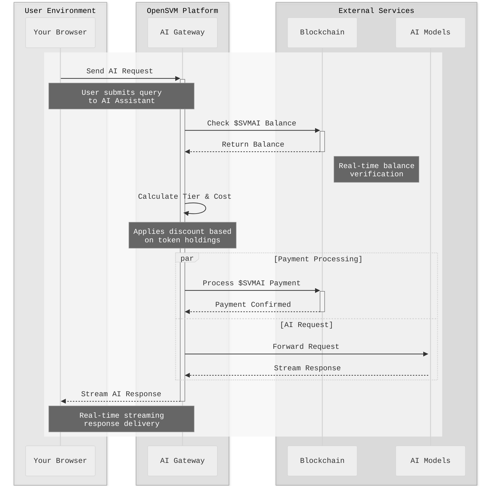
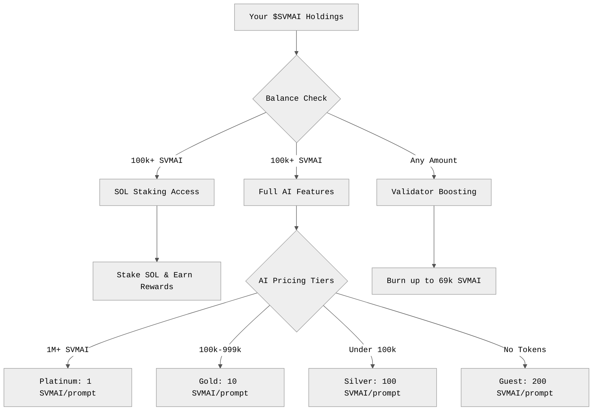
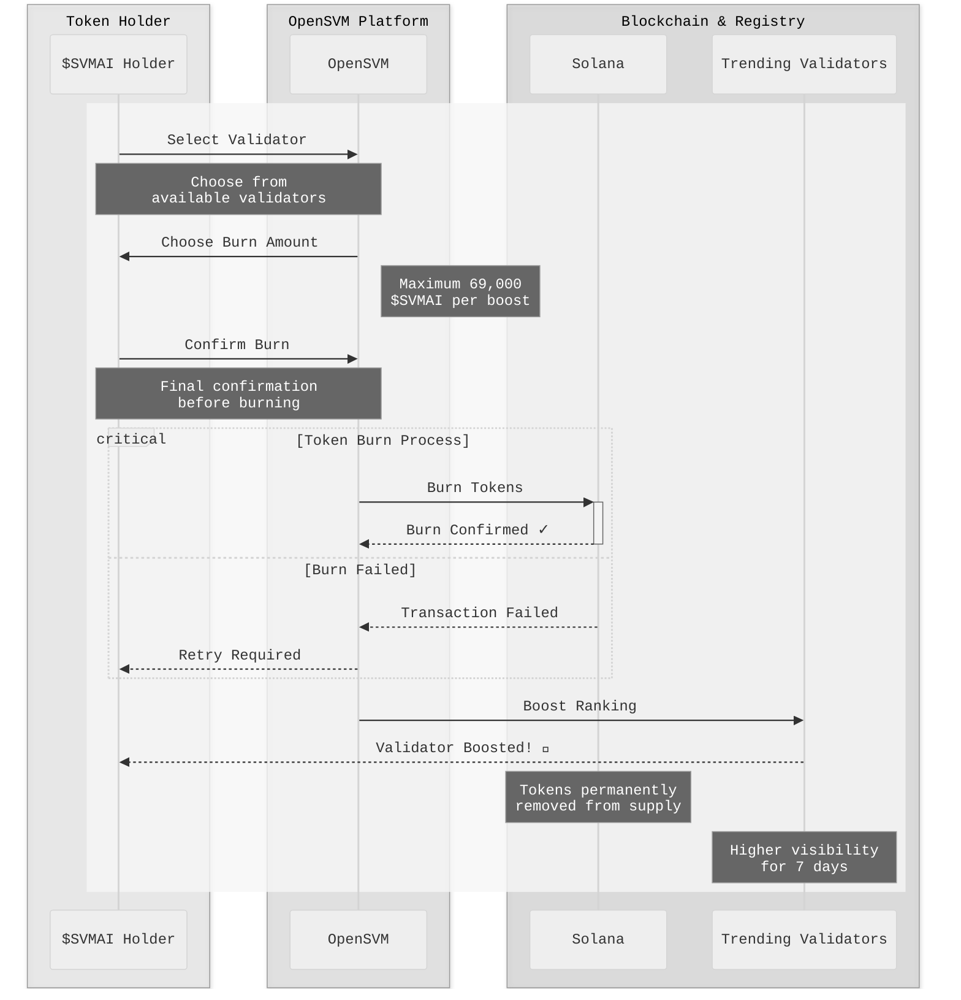
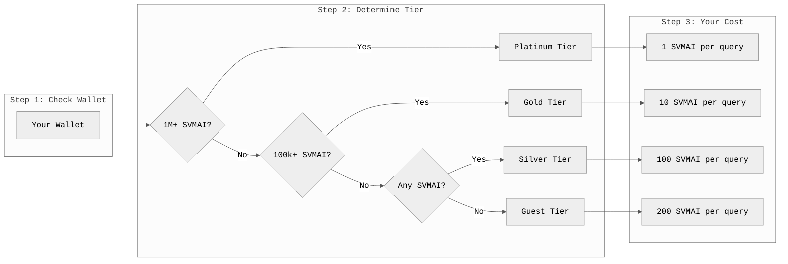

# Announcing Major Platform Upgrades for $SVMAI Holders!

We're thrilled to announce a massive update to the OpenSVM platform. This release is all about increasing the power and utility of your `$SVMAI` tokens and giving you a world-class explorer experience. Here’s what it means for you.

## 🔥 New Exclusive Utilities for Your $SVMAI Tokens

Your `$SVMAI` tokens are now your key to unlocking exclusive features and participating in the new token economy.

*   **Unlock SOL Staking with $SVMAI!**
    *   You can now stake **SOL** directly on the OpenSVM platform, and holding **at least 100,000 $SVMAI** is your key to access this feature.
    *   This provides a powerful new utility for holding `$SVMAI`, giving you access to SOL staking opportunities and their potential rewards.
    *   We've also included a handy calculator in the staking interface to help you estimate your potential SOL returns.

*   **Burn $SVMAI to Boost Validators!**
    *   Introducing a new deflationary burn mechanism! You can now burn your `$SVMAI` tokens to "boost" validators, increasing their visibility in the new "Trending Validators" list.
    *   You can burn **up to 69,000 $SVMAI** for each boost, giving you a powerful way to support validators while also reducing the token's total supply.

## ✨ A Smarter, Faster, and More Secure Explorer

We've made a host of under-the-hood improvements to make OpenSVM more powerful, intuitive, and reliable.

*   **AI-Powered Transaction Analysis**: Our explorer is now smarter than ever. We've integrated powerful AI from Anthropic and OpenRouter to provide much clearer, more detailed insights into your on-chain activity. With 27 Solana programs and 68 instruction definitions built-in, the platform can now explain even the most complex transactions in simple terms. The improved Transaction Graph helps you visualize complex transaction flows like never before.
*   **A Secure and Reliable AI Experience**: To power our new AI Assistant, we've built a secure gateway that acts as its front desk and concierge. This system safely checks your `$SVMAI` balance to give you the correct discount, handles all payments securely, and ensures the AI is always fast and available. It's the behind-the-scenes engine that makes your `$SVMAI` tokens powerful and your AI experience seamless.
*   **Full Claude Compatibility for Developers**: Our AI gateway is 100% compatible with Claude's official tools and SDKs. If you're a developer, you can use your favorite Claude tools (Python SDK, JavaScript SDK, or Claude CLI) by simply changing the base URL to `osvm.ai/v1` and using your OpenSVM API key. Your `$SVMAI` tokens automatically handle the payments, making it easy to build AI-powered applications on top of OpenSVM.
*   **Enhanced Validator Discovery**: We've added a new "Trending Validators" carousel and a dedicated Validators page to help you discover and evaluate validators more easily.
*   **A Smoother Experience**: We've shipped numerous UI improvements, including a more detailed account balance display, a better experience on mobile devices, and a more polished look and feel across the site.
*   **Improved Stability and Security**: We have squashed dozens of bugs (including critical ones for staking) and have patched several security vulnerabilities to keep your experience safe and seamless. The entire platform should now feel significantly faster and more responsive.

We are more committed than ever to building the best Solana explorer and bringing more value to the `$SVMAI` community. Thank you for your continued support! 

## How the AI Gateway Works

Here's a visual representation of how your `$SVMAI` tokens power the AI experience:

## Token Utility Overview

Here's how your `$SVMAI` tokens unlock different features across the platform:

## Validator Boost Mechanism

See how the burn-to-boost system works to support your favorite validators:

## AI Assistant Pricing Flow

Understanding how your token holdings determine AI costs:

