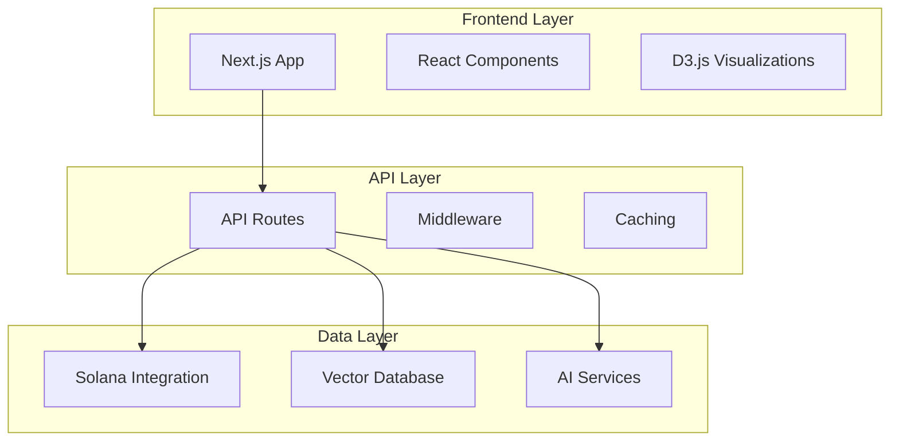

# OpenSVM - Solana Virtual Machine Explorer [](https://app.netlify.com/projects/opensvm/deploys)


OpenSVM is a comprehensive blockchain explorer for the Solana ecosystem, providing detailed insights into transactions, blocks, accounts, programs, and tokens on the Solana blockchain.

## Overview

OpenSVM offers a modern, user-friendly interface for exploring the Solana blockchain with advanced features like transaction visualization, wallet path finding, and AI-powered analysis. The project aims to make blockchain data more accessible and understandable for developers, users, and researchers.

## API Health Status [](./docs/api/health-check-report.md)

**Last Check:** November 2, 2025
- **✅ 71/97 endpoints operational** (73.2% success rate)
- **⚡ 807ms average response time** (Target: < 1000ms)
- **🚀 50-99% cache performance improvement**
- **📊 Best performing:** Transaction APIs (99ms avg)
- **⚠️ Needs attention:** Block APIs (4.2s avg)

[View Full Health Report](./docs/api/health-check-report.md) | [API Documentation](./docs/api/api-reference.md)

## Key Features

- **Blockchain Data Browsing**: Explore blocks, transactions, accounts, programs, and tokens
- **Transaction Visualization**: Interactive visualizations of transaction flows and relationships
- **Wallet Path Finding**: Discover connections between wallets through token transfers
- **AI Assistant**: Get natural language explanations of blockchain data and transactions
- **Network Statistics**: Monitor Solana network performance and health metrics
- **Token Analytics**: Track token transfers, balances, and activities

## Technology Stack

- **Frontend**: Next.js, React, TypeScript, Tailwind CSS
- **Blockchain Integration**: Solana Web3.js, SPL Token
- **Data Visualization**: D3.js, Cytoscape, Three.js, Chart.js
- **AI Components**: LLM integration via Together AI
- **State Management**: XState for complex workflows
- **Vector Database**: Qdrant for similarity search

## Getting Started

### Prerequisites

- Node.js 18+ or Bun
- Environment variables (see `.example.env`)

### Installation

```bash
# Clone the repository
git clone https://github.com/your-org/opensvm.git
cd opensvm

# Install dependencies
npm install
# or
bun install

# Set up environment variables
cp .example.env .env.local
# Edit .env.local with your configuration

# Start the development server
npm run dev
# or
bun run dev
```

### Building for Production

```bash
npm run build
npm run start
# or
bun run build
bun run start
```

## Documentation

For more detailed documentation, see:

- [Architecture Documentation](./docs/architecture/) - **📚 Comprehensive architectural documentation**
  - [System Overview](./docs/architecture/system-overview.md) - High-level system architecture
  - [Component Architecture](./docs/architecture/components.md) - Component breakdown and relationships
  - [Architecture Decision Records](./docs/architecture/adr/) - Architectural decisions and rationale
  - [Contributing Guide](./docs/architecture/CONTRIBUTING.md) - How to maintain architecture docs
- [API Documentation](./docs/api/)
  - [API Reference](./docs/api/api-reference.md) - Complete API endpoints and usage
  - [Health Check Report](./docs/api/health-check-report.md) - Latest API health status
  - [API Health Summary](./docs/api/api-health-summary.md) - Performance overview
  - [Optimization Summary](./docs/api/optimization-summary.md) - Performance optimizations
- [Testing Guide](./TESTING.md) - **🧪 Comprehensive testing documentation**
  - [DEX API Tests](./docs/DEX_API_TESTS.md) - DEX aggregator API test coverage
  - [Test Suite Summary](./docs/TEST_SUITE_SUMMARY.md) - Quick overview of all tests
- [Features](./docs/FEATURES.md) - Detailed feature descriptions
- [Development Guide](./docs/DEVELOPMENT.md) - Development setup and guidelines

### 🏗️ Architecture Overview

OpenSVM is built with a modular, scalable architecture:



**Key Architectural Principles:**
- **Modularity**: Clear separation of concerns with well-defined interfaces
- **Performance**: Optimized for fast response times and efficient resource usage
- **Scalability**: Designed for horizontal scaling and growth
- **Maintainability**: Comprehensive documentation and testing
- **Security**: Security-first design with proper access controls

For detailed architectural information, see our [Architecture Documentation](./docs/architecture/).

## License

[MIT License](LICENSE)
