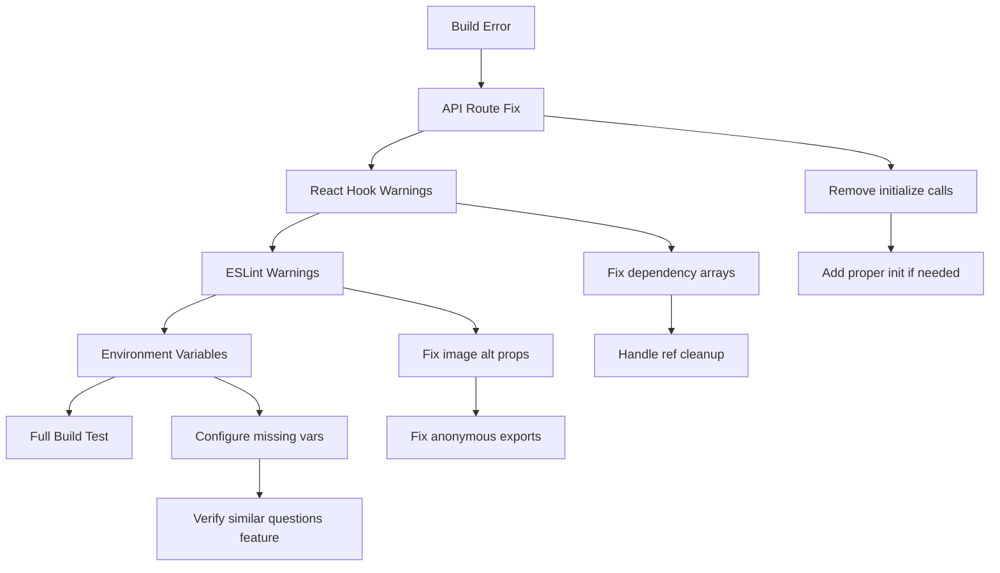

# Build Fix Comprehensive Plan

## Critical Build Error Analysis

**Primary Issue**: `TypeError: G.initialize is not a function` in `/api/v1/messages/route.js`
- **Root Cause**: Lines 74-79 in `app/api/v1/messages/route.ts` call `initialize()` methods that don't exist
- **Impact**: Prevents successful build completion

## Execution Strategy

### Phase 1: Critical Build Fix
1. **Fix API Route Initialization Error**
   - Remove non-existent `initialize()` calls in `app/api/v1/messages/route.ts:74-79`
   - Verify if async initialization is actually needed for these components
   - If needed, add proper `initialize()` methods to `APIKeyManager` and `BillingProcessor`

### Phase 2: React Hook Dependency Warnings
2. **ExportDialog.tsx (Line 116)**
   - Add missing dependencies: `config.filename` and `config.timestamp`

3. **GraphContext.tsx (Line 537)**
   - Copy `cyRef.current` to variable inside effect for cleanup function

4. **TransactionGraph.tsx (Line 136)**
   - Copy `containerRef.current` to variable inside effect for cleanup function

5. **TypeSafeHooks.ts (Lines 105, 269, 431)**
   - Fix non-array dependency list
   - Add missing dependencies: `abort` and `execute`
   - Handle spread elements in dependency arrays

6. **UserFeedDisplay.tsx (Line 488)**
   - Add missing dependencies: `connectionStatus`, `eventSource`, `retryCount`, `retryTimeout`

7. **Library Components**
   - Fix dependency warnings in `lib/caching/hooks.tsx` and `index.tsx`
   - Fix dependency warnings in `lib/error-handling/index.tsx`
   - Fix dependency warnings in `lib/performance/index.tsx`
   - Fix dependency warnings in `lib/rbac/index.tsx`
   - Fix dependency warnings in `lib/voice/index.tsx`
   - Fix dependency warnings in `lib/white-label/index.tsx`

### Phase 3: ESLint Warnings
8. **Image Alt Props**
   - Add `alt` prop to image elements in `CustomizationPanel.tsx:296`

9. **Anonymous Default Exports**
   - Assign objects to variables before exporting in:
     - `components/ui/animated-components.tsx:577`
     - `components/ui/micro-interactions.tsx:526`
     - `components/ui/optimistic.tsx:507`
     - `lib/caching/hooks.tsx:458`

### Phase 4: Environment Variables
10. **Missing Environment Variables**
    - Investigate "Missing required environment variables" warning
    - Configure variables for similar questions feature
    - Verify all required environment variables are properly set

### Phase 5: Verification
11. **Anthropic Client Verification**
    - Ensure `getAnthropicClient()` function works correctly
    - Verify API key handling and initialization flow

12. **Build Testing**
    - Run complete build process
    - Verify all warnings are resolved
    - Test API endpoints functionality

## Architecture Flow

## Success Criteria
- ✅ Build completes without errors
- ✅ All ESLint warnings resolved
- ✅ All React Hook warnings resolved
- ✅ Environment variables properly configured
- ✅ API endpoints functional
- ✅ Application runs successfully

## Risk Assessment
- **Low Risk**: React Hook dependency fixes (standard pattern)
- **Medium Risk**: API route initialization changes (needs testing)
- **Low Risk**: ESLint warning fixes (cosmetic improvements)