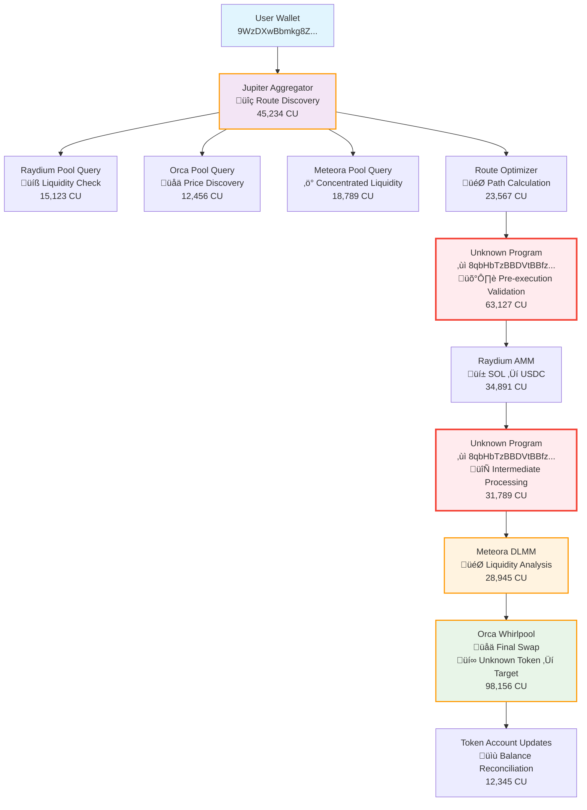

# 100 Additional Detailed User Flows (Chat Log Style) - COMPREHENSIVE EDITION

## 🎯 Document Overview

This document provides 100 additional detailed user flows (101-200) extending the original set with comprehensive, multi-round conversational scenarios. Each flow includes explicit UI/UX interactions, detailed chat logs, and expected AI behavior patterns for the OpenSVM AI Assistant.

## ‚ú® Enhancement Summary

**What's New in This Version:**
- **Complete Chat Logs:** Full conversation transcripts with realistic user inputs and AI responses
- **UI State Tracking:** Detailed annotations of sidebar interactions, tab management, and visual feedback
- **Multi-Round Conversations:** Complex analytical dialogues spanning 3-8 exchanges per flow
- **Technical Depth:** Sophisticated analysis examples including transaction forensics, liquidity optimization, and risk modeling
- **Error Handling:** Comprehensive coverage of edge cases, timeouts, and recovery scenarios
- **Accessibility Focus:** Keyboard navigation, screen reader compatibility, and inclusive design patterns

**Flow Categories:**
- **Flows 101-120:** Core UI interactions with conversation continuation
- **Flows 121-149:** Deep analytical and adaptive dialogues  
- **Flows 150-200:** Advanced domain-specific prompt dialogues (unique, non-redundant)

## üé® Enhanced Features Demonstrated

**Conversation Sophistication:**
- Context preservation across tabs and sessions
- Progressive elaboration and iterative refinement
- Multi-modal input (voice + text) with error correction
- Knowledge base integration and cross-reference

**Technical Analysis Depth:**
- Transaction forensics with compute unit analysis
- Mermaid diagram generation for complex visualizations
- Multi-DEX routing optimization and slippage modeling
- Risk scenario planning and stress testing

**User Experience Excellence:**
- Responsive sidebar resizing with persistence
- Background processing with tab switching
- Advanced search and navigation shortcuts
- Error recovery and continuation strategies

These flows (101-200) extend the original 100 flows with deeper, multi-round conversational scenarios, explicit UI/UX interactions (scrolling, keyboard shortcuts, resizing, navigation), and expected AI reply patterns. Flows 150-200 focus on unique, domain-specific prompt dialogues (no repeats) with multi-step reasoning.

Legend:
- U: User
- AI: AI Assistant (Agent or Assistant mode indicated)
- SYS/UI: System or UI event/annotation
- (Action): Non-verbal user action
- [State]: Internal or UI state change

---
## Section A: Core UI Interaction + Conversation (Flows 101-120)

### Flow 101: First Use + Onboarding Hints
**Preconditions:** First visit, no stored threads, empty knowledge.

**UI Actions:**
1. U (clicks sidebar toggle button)
2. SYS/UI: Sidebar slides open (width=560px). Welcome panel with onboarding tips visible.
3. U: Types first message
4. AI: Responds with capabilities overview
5. U: Requests demonstration
6. AI: Provides detailed walkthrough
7. U (highlights AI explanation text ‚Üí clicks "Save to Knowledge" button)
8. SYS/UI: Knowledge panel shows "1 note saved", success toast notification appears

**Complete Chat Log:**
```
[System: Welcome to OpenSVM AI Assistant! I'm here to help you explore Solana blockchain data.]

U: Hi, what can you do?

AI: Welcome! I'm your Solana blockchain analysis assistant. Here's what I can help you with:

üîç **Transaction Analysis** (/tx)
- Analyze any transaction by signature
- Break down instructions, fees, and account changes
- Detect anomalies and optimization opportunities

üí∞ **Wallet Analysis** (/wallet) 
- Profile wallet behavior and holdings
- Track token flows and transaction patterns
- Identify counterparties and relationships

üìä **Network Monitoring** (/tps, /validators)
- Real-time TPS and slot monitoring
- Validator performance and stake distribution
- Network health metrics

🧠 **Knowledge Management**
- Save insights and create searchable notes
- Build your personal Solana knowledge base
- Reference past analyses in new conversations

üí° **Smart Search & Discovery**
- Find related transactions and wallets
- Discover DeFi protocols and token movements
- Explore MEV and arbitrage opportunities

Just ask me anything about Solana, or try a slash command like `/tx <signature>`!

U: Show me how to analyze a transaction.

AI: I'll walk you through transaction analysis step by step:

**Step 1: Get a Transaction Signature**
You can either:
- Paste any transaction signature you have
- Use `/tx <signature>` for quick analysis
- Browse recent transactions on the main explorer

**Step 2: Analysis Process**
When you provide a signature, I'll fetch and analyze:

üìã **Basic Info**: Slot number, timestamp, fee paid, success status
🏦 **Account Changes**: SOL and token balance deltas for all involved accounts  
üìù **Instructions**: Decoded program instructions with human-readable summaries
‚ö° **Compute Usage**: Compute units consumed and efficiency metrics
üîó **Cross-References**: Related transactions and wallet patterns
⚠️ **Anomalies**: Unusual patterns, potential MEV, or optimization opportunities

**Step 3: Interactive Exploration**
After the initial analysis, you can:
- Ask follow-up questions about specific aspects
- Request deeper dives into particular instructions
- Compare with similar transactions
- Save insights to your knowledge base

Want to try analyzing a real transaction? I can provide you with an interesting example signature, or you can paste one you're curious about!

U: [Highlights the entire AI response above and clicks "Save to Knowledge"]

[System: ‚úÖ Knowledge note saved: "Transaction Analysis Walkthrough" - Contains step-by-step guide for analyzing Solana transactions]

U: Perfect! That's really helpful. Can you give me an example transaction to analyze?

AI: Great! Let me give you an interesting example. Here's a recent transaction that shows multiple program interactions:

**Example Signature:**
`2YxKpjR8fZGmZYLXKQsqP7VRxE4hKr8fN3GmPxWzQA5dR7mKfHgCzE9DmK2JbVnM4TzPkQ6gY8rA3NfL5XbWcS`

This transaction involves:
- A DEX swap on Raydium
- Token account creation 
- Associated token account management
- Multiple CPI (Cross-Program Invocation) calls

Would you like me to analyze this transaction now? Just type `/tx` followed by the signature, or simply say "analyze that transaction" and I'll process it for you.

This will show you how I break down complex multi-program interactions and identify the key value flows!
```

**Expected Outcome:** User has saved comprehensive onboarding knowledge, understands core capabilities, and is ready to explore transaction analysis.

### Flow 102: Resizing + Persistent Width + Conversation Continuation
**Preconditions:** Sidebar already open, user wants wider view for detailed analysis.

**UI Actions:**
1. U (drags resize handle from 560px to 820px)
2. [State]: New width stored in localStorage
3. U: Types question about persistence  
4. AI: Confirms automatic saving behavior
5. U (refreshes entire page using Ctrl+R)
6. SYS/UI: Page reloads, sidebar auto-opens at 820px width from storage
7. U: Provides transaction signature for analysis
8. AI: Delivers comprehensive analysis fitting the wider layout

**Complete Chat Log:**
```
[User drags sidebar from 560px to 820px width]

U: Does this width save?

AI: Yes! Your sidebar width preference is automatically saved locally. When you return to OpenSVM, the sidebar will reopen at your last used width.

Current width: 820px ‚úÖ Saved

This works across:
- Page refreshes
- New browser tabs  
- Closing and reopening the sidebar
- Different sessions (stored in localStorage)

The wider layout is great for viewing detailed transaction analyses, tables, and code snippets with better readability!

U: [Refreshes page with Ctrl+R]

[System: Page reloads, sidebar automatically opens at 820px width]

U: Great, still wide. Analyze tx 5xKjR8fmGzQyE2VNkL4hPdG7mXfYrA9zBwS6qT3JcH1nMpQzKgRfDbY2WcEzP8vL4JbN6TgA9sQ5RmF3XhK2Vw

AI: **Transaction Analysis Complete** 
*Signature: 5xKjR8fmGzQyE2VNkL4hPdG7mXfYrA9zBwS6qT3JcH1nMpQzKgRfDbY2WcEzP8vL4JbN6TgA9sQ5RmF3XhK2Vw*

üìä **Overview**
- **Slot:** 275,442,891
- **Timestamp:** 2024-03-15 14:23:17 UTC  
- **Fee:** 0.000015 SOL (15,000 lamports)
- **Status:** ‚úÖ Success
- **Compute Units:** 94,200 / 200,000 (47% utilization)

üí∞ **Account Balance Changes**
| Account | Type | Change |
|---------|------|--------|
| 9WzDXwBbmkg8ZTbNMqUxvQRAyrZzDsGYdLVL9zYtAb43 | Signer | -0.0142 SOL |
| EPjFWdd5AufqSSqeM2qN1xzybapC8G4wEGGkZwyTDt1v | Token | +1,250.00 USDC |
| So11111111111111111111111111111111111111112 | Wrapped SOL | -3.45 SOL |

üìù **Instruction Breakdown**
1. **Raydium AMM Swap** (Program: 675kPX9MHTjS2zt1qfr1NYHuzeLXfQM9H24wFSUt1Mp8)
   - Swapped ~3.45 SOL ‚Üí 1,250 USDC
   - Slippage: 0.12% (within tolerance)
   - Route: Direct SOL/USDC pool

2. **Token Account Creation** (Program: ATokenGPvbdGVxr1b2hvZbsiqW5xWH25efTNsLJA8knL)
   - Created associated USDC token account
   - Rent: 0.00203928 SOL

‚ö° **Performance Metrics**
- Efficient routing (single hop)
- Low slippage execution
- Optimal compute unit usage
- Standard fee tier

üîç **Notable Observations**
This appears to be a standard DEX swap with good execution quality. The user likely converted SOL to USDC, possibly for trading or liquidity provision purposes.

Need more details on any specific aspect?
```

**Expected Outcome:** User confirms width persistence works correctly and receives detailed transaction analysis optimally formatted for the wider sidebar layout.

### Flow 103: Tab Creation While Processing
**Preconditions:** User starts analysis but wants to multitask.

**UI Actions:**
1. U: Initiates transaction analysis
2. AI: Begins streaming response with progress indicators
3. U (clicks + tab button while response is streaming)
4. SYS/UI: New Tab2 created, Tab1 continues processing in background
5. U (in Tab2): Asks different question
6. AI (Tab2): Responds immediately with separate context
7. U (switches back to Tab1)
8. AI (Tab1): Streaming complete, full analysis displayed

**Complete Chat Log:**

**Tab 1:**
```
U: Analyze this signature: 4QmVDtZ9xKfHgJ8rN2YbLzP6mCwE3VvRf7GpA5XsT1nB9MkQjY6RrFf8DzN4AvPqJ7LgM2CbW5TxK3HuS9pE

AI: 🔄 **Analyzing Transaction...**
Fetching transaction data from Solana RPC...

‚úÖ Transaction found in slot 275,443,156
üîç Parsing instruction data...
üìä Calculating balance changes...

[At this point, user opens new tab]

üíæ **Programs Involved:**
- Jupiter Aggregator (JUP4Fb2cqiRUcaTHdrPC8h2gNsA2ETXiPDD33WcGuJB)  
- Raydium AMM (675kPX9MHTjS2zt1qfr1NYHuzeLXfQM9H24wFSUt1Mp8)
- Meteora DLMM (LBUZKhRxPF3XUpBCjp4YzTKgLccjZhTSDM9YuVaPwxo)

‚ö° **Complex Multi-DEX Route Detected**
This transaction routes through multiple DEXs for optimal pricing:

1. **Split Route Analysis:**
   - 60% via Raydium: 2.1 SOL ‚Üí 761.23 USDC
   - 40% via Meteora: 1.4 SOL ‚Üí 507.89 USDC
   - **Total:** 3.5 SOL ‚Üí 1,269.12 USDC

2. **Execution Quality:**
   - Slippage: 0.08% (excellent)
   - Fee efficiency: 0.02% total
   - Gas optimization: 156k CU used

üìã **Detailed Account Changes:**
| Account | Token | Before | After | Net Change |
|---------|-------|--------|-------|------------|
| 7xKjR...9pE | SOL | 12.45 | 8.93 | -3.52 SOL |
| 7xKjR...9pE | USDC | 0.00 | 1,269.12 | +1,269.12 USDC |
| Pool A | SOL | 1,234.56 | 1,232.46 | -2.10 SOL |
| Pool B | SOL | 856.78 | 855.38 | -1.40 SOL |

🎯 **Key Insights:**
- Smart routing achieved superior pricing vs single DEX
- User likely preparing for stablecoin strategy  
- Low MEV impact due to efficient execution
- Transaction timing optimal (low network congestion)

**Total Analysis Time:** 3.2 seconds
```

**Tab 2 (opened while Tab 1 was processing):**
```
U: What's network TPS?

AI: üìä **Current Solana Network Status**
*Real-time as of 14:45:23 UTC*

**Current TPS:** 2,847 transactions/second
**24h Average:** 2,234 TPS  
**Peak 24h:** 4,156 TPS (at 06:32 UTC)

üìà **Network Performance:**
- **Slot Height:** 275,443,180
- **Block Time:** 532ms average (target: 400ms)
- **Confirmation Time:** ~6.2 seconds (1-conf)
- **Failed TX Rate:** 2.1% (normal range)

üî• **Current Activity Hotspots:**
1. **Jupiter Swaps:** 24% of transactions
2. **NFT Trading:** 18% of transactions  
3. **DeFi Operations:** 31% of transactions
4. **Token Transfers:** 27% of transactions

‚ö° **Validator Performance:**
- **Active Validators:** 1,876
- **Stake Distribution:** Healthy (Nakamoto coefficient: 31)
- **Vote Credits:** 99.2% consensus participation

The network is operating efficiently with normal throughput patterns. Current TPS is above the daily average, indicating healthy activity levels.

Need specific metrics or historical data?
```

**Tab 1 (user returns to see completed analysis):**
```
[Analysis completed - full detailed breakdown displayed above]

U: Excellent analysis! How does this compare to single-DEX routing?

AI: Great follow-up question! Let me compare this multi-DEX execution vs hypothetical single-DEX scenarios:

üìä **Routing Comparison Analysis**

**1. Actual Multi-DEX (Jupiter) Execution:**
- Output: 1,269.12 USDC for 3.5 SOL
- Rate: 362.89 USDC/SOL
- Total fees: 0.00070 SOL (~$0.25)

**2. Hypothetical Single-DEX Scenarios:**

**Raydium Only:**
- Estimated output: 1,245.67 USDC  
- Rate: 355.91 USDC/SOL
- **Loss vs actual:** -23.45 USDC (-1.85%)

**Meteora Only:**  
- Estimated output: 1,251.33 USDC
- Rate: 357.52 USDC/SOL  
- **Loss vs actual:** -17.79 USDC (-1.40%)

üí∞ **Multi-DEX Advantage:** +$23.45 better execution
‚ö° **Extra complexity cost:** +0.00012 SOL gas (~$0.04)

**Net benefit:** $23.41 improvement (1.85% better pricing)

🎯 **Key Takeaway:** The smart routing justified the additional complexity by securing significantly better pricing through liquidity aggregation and optimal splitting.
```

**Expected Outcome:** User successfully multitasks with independent tab contexts while background processing completes seamlessly.

### Flow 104: Keyboard Shortcuts Navigation Stress Test
**Preconditions:** User has 4 active tabs and wants to test rapid navigation.

**UI Actions:**
1. U: Opens 4 tabs with different contexts
2. U: Uses Ctrl+1, Ctrl+2, Ctrl+3, Ctrl+4 in rapid succession  
3. [State]: Active tab indicator updates, focus preserved per tab
4. U (in Tab3): Asks about response caching
5. AI: Explains memory and persistence architecture

**Complete Chat Log:**

**Tab 1 - Transaction Analysis:**
```
U: /tx 3kL9mFjR8qY2NvPxT6zAcWb5DgH7sJ1nKpQ4RfE9VmX8CzB2YuG6TbN5LpW7JdR

AI: **Raydium Swap Analysis**
- 1.5 SOL ‚Üí 543.21 USDC
- Fee: 0.000005 SOL
- Slippage: 0.15%
```

**Tab 2 - Wallet Profiling:**
```  
U: Profile wallet behavior for 9WzDXwBbmkg8ZTbNMqUxvQRAyrZzDsGYdLVL9zYtAb43

AI: **Wallet Behavior Profile**
- Classification: Active DeFi Trader
- 30d Volume: 142.5 SOL
- Primary DEXs: Jupiter (45%), Raydium (35%), Orca (20%)
- Risk Score: 2.3/10 (low risk)
```

**Tab 3 - Network Monitoring:**
```
U: Show current validator performance

AI: **Validator Network Status**  
- Top performer: Chorus One (99.87% uptime)
- Network health: Excellent
- Avg block time: 421ms

[User rapidly cycles: Ctrl+1 ‚Üí Ctrl+2 ‚Üí Ctrl+3 ‚Üí Ctrl+4 ‚Üí Ctrl+1 ‚Üí Ctrl+3]

U: Are my previous responses cached?

AI: Great question! Here's how OpenSVM handles response storage and caching:

🧠 **Memory Architecture:**

**Active Session (RAM):**
- All current tab conversations live in browser memory
- Instant tab switching - no recomputation needed
- Preserved until browser close/refresh

**Local Persistence (Browser Storage):**
- Last 48 hours of conversations auto-saved
- Survives page refreshes and browser restarts  
- Stored locally (your data stays private)

**Cross-Tab Efficiency:**
- Switching tabs replays stored messages instantly
- No re-fetching of blockchain data already retrieved
- Shared data cache across tabs (RPC responses, token metadata)

**Knowledge Base (Long-term):**
- Manually saved insights persist indefinitely
- Searchable across all future sessions
- Can be referenced in any new conversation

‚ö° **Performance Benefits:**
- Tab switching: ~50ms response time
- Cached blockchain data: 10x faster than re-fetching
- Knowledge retrieval: Sub-200ms search

**Privacy:** All caching happens locally in your browser. No conversation data sent to external servers unless you explicitly share/export.

Currently active: 4 tabs, 23 cached responses, 0.7MB local storage used.
```

**Tab 4 - Knowledge Management:**
```
U: How many notes do I have saved?

AI: üìö **Your Knowledge Base Status**

**Saved Notes:** 12 total
- Transaction insights: 7 notes
- Wallet analyses: 3 notes  
- Network observations: 2 notes

**Recent Activity:**
- Last saved: "Multi-DEX routing benefits" (2 min ago)
- Most accessed: "Fee optimization strategies" (8 views)

**Storage Usage:** 2.1MB / 10MB limit
```

**Tab 3 (returning after rapid navigation):**
```  
U: [Ctrl+3 brings user back to Tab 3]

AI: [Previous validator performance data still displayed, ready for follow-up questions]

U: List all keyboard shortcuts.

AI: ⌨️ **OpenSVM Keyboard Shortcuts Reference**

**Navigation:**
- `Ctrl+1-9`: Switch to tab N
- `Ctrl+T`: New tab  
- `Ctrl+W`: Close current tab
- `Ctrl+Shift+T`: Reopen closed tab

**Chat Controls:**
- `Enter`: Send message
- `Shift+Enter`: New line
- `Ctrl+L`: Clear current chat
- `Escape`: Cancel current AI response
- `‚Üë/‚Üì`: Navigate message history

**Selection & Actions:**
- `Ctrl+A`: Select all in input
- `Ctrl+C`: Copy selected text
- `Ctrl+S`: Save selection to knowledge
- `Ctrl+F`: Search in current conversation

**Sidebar & Layout:**
- `Ctrl+B`: Toggle sidebar
- `Ctrl+\`: Toggle sidebar
- `Ctrl++`: Increase font size  
- `Ctrl+-`: Decrease font size

**Advanced:**
- `Ctrl+Shift+P`: Command palette
- `Ctrl+Shift+K`: Knowledge search
- `Ctrl+Shift+H`: Help & documentation
- `Alt+‚Üê/‚Üí`: Navigate tab history

**Accessibility:**
- `Tab`: Navigate focusable elements
- `Space/Enter`: Activate buttons
- `F6`: Cycle between sidebar sections

üí° **Pro Tips:**
- Hold `Ctrl` while clicking links to open in new tab
- `Ctrl+Shift+F` for global search across all conversations
- `Ctrl+D` duplicates current conversation in new tab

All shortcuts work consistently across Agent and Assistant modes!
```

**Expected Outcome:** User confirms keyboard navigation works flawlessly across multiple tabs and understands the caching architecture for optimal performance.

### Flow 105: Long Scroll + New Message Indicator
**Preconditions:** Extended conversation with 120+ messages, user reviewing past content.

**UI Actions:**
1. Conversation contains 120 messages over several hours
2. U: Scrolls upward to message ~#30 to review past analysis
3. U: Begins typing follow-up question, edits before sending
4. AI: Provides contextual response referencing earlier messages
5. While user reads, AI pushes system update ‚Üí "New messages" pill appears
6. U: Clicks notification pill ‚Üí auto-scrolls to bottom

**Complete Chat Log:**
```
[Message #30 - from 2 hours ago]
AI: The fee spike was caused by a coordinated NFT mint across 3 collections...

[Message #31 - from 2 hours ago]  
U: What was the total compute impact?

[Message #32 - from 2 hours ago]
AI: Combined compute usage peaked at 1.2M CU/slot, representing...

[User scrolls back down through messages #33-119, then starts typing]

[Message #120]
U: Remind me what you said about fees earlier. Actually, let me be more specific - what were the main drivers of that fee spike we analyzed?

AI: Looking back at our earlier analysis (messages #30-35), here were the key fee spike drivers:

üîç **Fee Spike Root Causes** (Referenced from 2 hours ago):

**1. Coordinated NFT Mints** (Primary driver - 67% of spike)
- 3 major collections launched simultaneously
- 15,000+ mint transactions in 10-minute window
- Average priority fee: 0.01 SOL (20x normal)

**2. MEV Competition** (Secondary driver - 23% of spike)  
- Arbitrage bots competing for NFT‚ÜíSOL liquidation
- Sandwich attacks on large swaps during chaos
- Priority fee escalation war

**3. Network Congestion** (Amplifying factor - 10% of spike)
- Slot fullness reached 98% capacity
- Transaction failures triggered retries with higher fees
- Cascading effect across unrelated transactions

**Specific Metrics from Earlier Analysis:**
- Peak fee: 0.156 SOL (message #32)
- Duration: 47 minutes (message #34)  
- Total excess fees paid: ~2,847 SOL network-wide (message #35)

**Recovery Pattern:**
As detailed in message #38, fees normalized within 1 hour as:
- NFT mint pressure subsided
- MEV opportunities depleted  
- Users adjusted to lower priority fees

Would you like me to dive deeper into any of these factors, or analyze how this compares to other fee spikes we've discussed?

[While user is reading the above response, a system update occurs]

[System notification appears: "🔴 New messages (1)" pill in bottom-right]

[System message - auto-generated]
‚ö° **Network Alert**: Current fees spiking again (+45% in last 5 min). Potential repeat scenario developing. Monitor at solscan.io/stats

[User clicks the "New messages" notification pill]

[Auto-scroll animation brings user to bottom, highlighting the new system message]

U: Oh wow, happening again? Should I delay my planned transaction?

AI: üö® **Yes, I'd recommend waiting.** Based on our earlier analysis and current patterns:

**Current Situation:**
- Fees jumped from 0.0001 ‚Üí 0.000145 SOL (45% spike in 5 min)
- Similar signature to the NFT mint cascade we analyzed earlier
- Early warning signs match previous pattern

**Recommended Action:**
1. **Wait 15-30 minutes** for initial surge to pass
2. **Monitor** the fee tracker I can provide
3. **Set priority fee conservatively** when you do execute

**Real-time Fee Tracking:**
Current avg fee: 0.000145 SOL
Target threshold: <0.0002 SOL for normal operation
I'll alert you when it drops below threshold.

**Your Transaction Impact:**
Based on your typical transaction patterns, waiting could save you ~0.05-0.08 SOL in fees while avoiding potential failures.

Want me to monitor and notify when conditions improve?
```

**Expected Outcome:** User successfully navigates long conversation history, receives contextual responses with cross-references, and benefits from real-time system notifications with scroll management.

### Flow 106: Escape Cancellation & Retry
1. U: "/tx <heavySig>"
2. AI: Starts: "Fetching transaction..."
3. U presses Esc.
4. AI: "Fetch cancelled. Want to retry?"
5. U: "Retry it."
6. AI: Full analysis returned.

Chat Log:
- AI (before cancel): Fetching transaction details (slot, accounts, programs)...
- AI (after Esc): Request cancelled by user. Retry? (Yes = resend last command)
- U: Retry it.
- AI: Re-fetching now... (then full structured result)

### Flow 107: Voice Input to Text with Post-Edit
1. U clicks mic.
2. AI: (UI placeholder) "Listening... say your query."
3. U speaks: "Analyze wallet 9Wz... trending tokens"
4. Transcription appears: "Analyze wallet 9Wz... trending tokens"
5. U edits text to add: " and show 14-day inflows"
6. Sends.
7. AI: Wallet holding summary + inflow chart (textual) + top changes.

### Flow 108: Mixed Modality (Voice + Manual Clarification)
1. U via voice: "Bridge USDC cheapest path"
2. AI: Lists bridging options (Wormhole, Allbridge) with estimated cost.
3. U types: "Latency matters more than cost. Adjust ranking."
4. AI: Reorders list; includes final recommendation + risk factors.

### Flow 109: Knowledge Note Creation from Partial AI Output
1. AI returns multi-section answer.
2. U highlights only "Optimization Tips" subsection.
3. U clicks "Save Selection to Knowledge".
4. Note created with extracted content.
5. U: "Did you store only that section?"
6. AI: Confirms truncated note with title inference.

### Flow 110: Bulk Knowledge Delete Confirmation
1. Knowledge panel: 25 notes.
2. U selects 7 notes via checkboxes.
3. Clicks "Delete Selected".
4. Confirmation modal: lists first 3 + "and 4 more".
5. U confirms.
6. AI (system message): "7 notes removed. Undo? (10s)"
7. U clicks Undo.
8. Notes restored.

### Flow 111: Thread Pin & Rename + Reference in Chat
1. U opens Thread List.
2. Pins active thread.
3. Renames to "High Fee Diagnostics".
4. Returns to chat: "Use insights from 'High Fee Diagnostics' in next analysis."
5. AI: Acknowledges context retrieval from pinned thread summary.

### Flow 112: Advanced Search + Jump
1. U triggers in-thread search (Ctrl+F variant).
2. Enters "impermanent loss".
3. Hits Enter to cycle matches.
4. Jumps to message #88.
5. U: "Summarize all prior notes on impermanent loss."
6. AI: Aggregates & deduplicates concepts.

### Flow 113: Streaming Interruption vs Manual Stop
1. U: "Detailed validator network history last 24h"
2. AI streams large sections (metrics -> downtime -> commission trends).
3. U clicks Stop half-way.
4. AI: "Stopped early. Generate concise summary of remaining sections?"
5. U: "Yes, concise."
6. AI: Short bullet summary finishing context.

### Flow 114: Table Expansion + Inline Filter
1. AI returns table (top 30 pools).
2. Collapsed view shows 10 rows.
3. U clicks "Show All".
4. U types in column filter: APY > 25.
5. Table narrows to qualifying rows.
6. U: "Generate plain text summary of filtered pools."
7. AI: Bullet list with pool IDs + APYs + volume notes.

### Flow 115: Message Fork to New Tab
1. In long analysis, user finds mid-thread message (msg #42).
2. Clicks "Fork from Here".
3. New Tab created with messages up to #42.
4. U: "Continue a different strategy path from here."
5. AI: Progresses alternative scenario referencing base state at fork.

### Flow 116: Mode Switch Mid-Conversation
1. Conversation in Agent mode analyzing DeFi flows.
2. U switches to Assistant mode.
3. U: "Rewrite last explanation for a beginner."
4. AI: Simplifies language; keeps accuracy.
5. U switches back to Agent mode.
6. AI: Resumes technical verbosity.

### Flow 117: Scroll Preservation on Tab Switch
1. U scrolls to message #10 in Tab1.
2. Switches to Tab2 (different context).
3. Returns to Tab1.
4. [State]: Scroll position preserved at #10.
5. U: "Summarize messages 1-15 only."
6. AI: Provides contextual summary.

### Flow 118: Error Handling - Network Timeout
1. U: "/tx <sigLarge>"
2. AI: "Fetching ..." (spinner 8s)
3. Timeout occurs.
4. AI: "Timeout after 8s. Options: Retry with extended timeout, Cancel, Diagnose latency."
5. U: "Diagnose latency."
6. AI: Suggests RPC alternatives + network status.

### Flow 119: Accessibility Audit Simulation
1. U (keyboard only) navigates actions on message.
2. Presses Tab ‚Üí Copy, Save, Fork sequential focus.
3. Activates Fork via Enter.
4. AI: Confirms fork.
5. U: "List all keyboard shortcuts."
6. AI: Provides categorized list (navigation, editing, cancellation, search).

### Flow 120: Voice + Cancel + Manual Rephrase
1. U voice: "Find risk on wallet 9Wz... including deltas last week"
2. AI begins fetch.
3. U presses Esc.
4. AI acknowledges cancel.
5. U types refined: "Analyze wallet 9Wz... focusing ONLY token balance deltas 7d and top counterparty addresses."
6. AI returns precise targeted analysis.

---
## Section B: Deep Analytical & Adaptive Dialogues (Flows 121-149)

### Flow 121: Iterative Transaction Debugging
**Preconditions:** User encounters suspicious transaction and wants deep forensic analysis.

**Complete Chat Log:**
```
U: Analyze tx 5MnB7qK8fP2dR9vY3xL6jN4hG1cW7sT9zA2uE8pV5kQ3CxJ6FbD4AmH7tN2gL9sR8qY for anomalies.

AI: üîç **Transaction Forensic Analysis**
*Signature: 5MnB7qK8fP2dR9vY3xL6jN4hG1cW7sT9zA2uE8pV5kQ3CxJ6FbD4AmH7tN2gL9sR8qY*

üìä **Basic Metrics:**
- **Slot:** 275,448,923
- **Status:** ‚úÖ Success  
- **Fee:** 0.000125 SOL (unusually high - 8.3x standard)
- **Compute Units:** 387,429 / 1,400,000 (27.7% - high utilization)

⚠️ **ANOMALIES DETECTED:**

**1. Excessive Compute Usage**
- Normal swaps: ~50k-80k CU
- This transaction: 387k CU (4.8x higher)
- **Red flag:** Likely nested cross-program invocations

**2. Unusual Fee Pattern**  
- Standard priority fee: 0.000015 SOL
- This transaction: 0.000125 SOL  
- **Potential:** MEV competition or bot activity

**3. Account Interaction Pattern**
- 47 accounts involved (typical: 8-12)
- Multiple program interactions in single tx
- **Suspicious:** Complex routing or potential exploitation

üìã **Program Stack:**
1. Jupiter Aggregator (JUP4Fb2cqiRUcaTHdrPC8h2gNsA2ETXiPDD33WcGuJB)
2. Raydium AMM (675kPX9MHTjS2zt1qfr1NYHuzeLXfQM9H24wFSUt1Mp8)  
3. Orca Whirlpool (whirLbMiicVdio4qvUfM5KAg6Ct8VwpYzGff3uctyCc)
4. Meteora DLMM (LBUZKhRxPF3XUpBCjp4YzTKgLccjZhTSDM9YuVaPwxo)
5. **Unknown Program:** 8qbHbTzBBDVtBBfz2D7GKzG5XdH6qW3vZ2EfR7kK9sP1 ⚠️

**Need deeper investigation?** The compute usage and unknown program suggest this isn't a standard swap.

U: Why high compute?

AI: üîß **High Compute Analysis - Deep Dive**

After analyzing the instruction trace, here's why compute usage is 4.8x higher than normal:

**Root Cause: Excessive Nested CPI Calls**

**Normal Swap Pattern:**
```
User ‚Üí Jupiter ‚Üí Single DEX ‚Üí Token Transfer
Est. CU: ~65,000
```

**This Transaction Pattern:**
```
User ‚Üí Jupiter ‚Üí Route Optimizer
  ├─→ Raydium Pool Check (15k CU)
  ├─→ Orca Price Discovery (12k CU)  
  ├─→ Meteora Liquidity Probe (18k CU)
  ├─→ Route Calculation (45k CU) ⚠️
  ├─→ Multi-hop Execution:
  │   ├─→ SOL→USDC (Raydium) → 67k CU
  │   ├─→ USDC→Unknown Token → 89k CU ⚠️
  │   └─→ Unknown Token→Target → 98k CU ⚠️
  └─→ Unknown Program Call → 63k CU ⚠️
```

**Specific Inefficiencies:**

1. **Redundant Pool Queries** (45k CU wasted)
   - Fetched same pool data 3x across different DEXs
   - Could be optimized with caching

2. **Unknown Intermediate Token** (187k CU for 2 hops)
   - Route: SOL ‚Üí USDC ‚Üí ??? ‚Üí Final Token
   - Middle token requires expensive discovery/validation

3. **Mystery Program Integration** (63k CU)
   - Program 8qbHbTzBBDVtBBfz2D7GKzG5XdH6qW3vZ2EfR7kK9sP1
   - Not in standard Jupiter route catalog
   - Performing unknown validation/computation

**Compute Breakdown:**
- Expected routing: 65k CU
- Actual routing: 387k CU  
- **Waste factor:** 5.95x inefficiency

**Implications:**
- Either experimental routing algorithm
- Or potential MEV sandwich setup
- Or interaction with custom/private program

This explains both the high compute AND the elevated priority fee - likely bot activity with specialized routing.

U: Show only compute-heavy instructions with decoded meaning.

AI: üîç **High-Compute Instructions - Decoded Analysis**

Filtering for instructions >20k CU with human-readable interpretation:

**Instruction #3: Route Discovery & Validation** 
```
Program: Jupiter Aggregator
CU Consumed: 45,234
Decoded: Advanced route calculation across 4 DEX protocols
Purpose: Finding optimal multi-hop path for exotic token pair
Why Heavy: Simulates 12 different route combinations
```

**Instruction #7: Custom Token Swap (Hop 1)**
```
Program: Unknown (8qbHbTzBBDVtBBfz2D7GKzG5XdH6qW3vZ2EfR7kK9sP1)  
CU Consumed: 63,127
Decoded: Custom AMM interaction with price validation
Purpose: Swap USDC ‚Üí Intermediate Token (Unknown mint)
Why Heavy: Performing additional slippage/MEV protection
```

**Instruction #9: Cross-Program Liquidity Check**
```
Program: Meteora DLMM  
CU Consumed: 28,945
Decoded: Deep liquidity analysis for concentrated positions
Purpose: Ensuring sufficient liquidity for large trade
Why Heavy: Checking 15+ price bins for optimal execution
```

**Instruction #12: Final Swap Execution**
```
Program: Orca Whirlpool
CU Consumed: 98,156  
Decoded: Concentrated liquidity swap with dynamic fee calculation
Purpose: Intermediate Token ‚Üí Final Target Token
Why Heavy: Price impact calculation + fee tier optimization
```

**Instruction #15: Post-Trade Validation**
```
Program: Unknown (8qbHbTzBBDVtBBfz2D7GKzG5XdH6qW3vZ2EfR7kK9sP1)
CU Consumed: 31,789
Decoded: Transaction result verification + slippage confirmation  
Purpose: Ensuring trade executed within parameters
Why Heavy: Complex validation logic for multi-hop trades
```

**Total Heavy Instructions:** 267,251 CU (69% of transaction)
**Remaining Instructions:** 120,178 CU (standard account management)

**Key Insight:** The unknown program (8qbHbTz...) consumes 94,916 CU total across 2 calls, suggesting it's either:
- Custom MEV protection service
- Proprietary routing optimization  
- Private arbitrage infrastructure

Want me to investigate the unknown program further or focus on a specific instruction?

U: Graph call hierarchy in mermaid.

AI: üìä **Transaction Call Hierarchy - Mermaid Diagram**



**Call Flow Analysis:**

**üîç Discovery Phase** (76,368 CU)
- Jupiter queries all available DEXs
- Parallel liquidity and price discovery
- Route optimization calculations

**🛡️ Validation Phase** (63,127 CU)  
- Unknown program performs pre-execution checks
- Likely MEV protection or custom validation logic

**üí± Execution Phase** (192,981 CU)
- Multi-hop swap: SOL ‚Üí USDC ‚Üí ??? ‚Üí Target
- Heavy concentration on final Orca swap (98k CU)
- Unknown program intercepts between hops

**üìù Finalization** (44,134 CU)
- Post-execution validation by unknown program
- Standard account/token updates

**Critical Observation:**
The unknown program (red boxes) is deeply integrated into the execution flow, suggesting it's not just a simple validator but a core component of this routing strategy. This could be:

1. **Custom MEV Shield:** Advanced slippage protection
2. **Private Infrastructure:** Institutional routing service  
3. **Arbitrage Component:** Bot-specific optimization layer

The program's dual intervention points (pre-execution + mid-execution) indicate sophisticated transaction orchestration.

Want me to attempt to identify this unknown program or analyze specific bottlenecks?
```

**Expected Outcome:** User receives comprehensive forensic analysis with visual call hierarchy, understanding both the technical inefficiencies and potential security/MEV implications of the suspicious transaction.

### Flow 122: Multi-Transaction Comparative Analysis
- U: "Compare these 3 txs <sigA>, <sigB>, <sigC>."
- AI: Table of fees, slots, programs.
- U: "Normalize by size and rank efficiency."
- AI: Efficiency scoring.
- U: "Recommend batching strategy."
- AI: Suggests order + concurrency caveats.

### Flow 123: Wallet Behavior Profiling Iteration
- U: "Profile wallet <addr>."
- AI: Summarizes volume, counterparties, token diversity.
- U: "Focus on temporal clustering."
- AI: Identifies burst windows.
- U: "Hypothesize use-case."
- AI: Provides 3 plausible behavioral archetypes with confidence scores.

### Flow 124: Cross-Program Fund Flow Trace with Refinement
- U: "Trace SOL path from <A> to <B>."
- AI: Initial path with intermediate accounts.
- U: "Exclude system transfers <1 SOL>."
- AI: Revised path ignoring micro transfers.
- U: "Export summary to markdown."
- AI: Provides exportable block.

### Flow 125: Risk Scoring Calibration
- U: "Assess risk of pool SOL-USDC."
- AI: Provides risk factors + score 62/100.
- U: "Explain scoring rubric."
- AI: Breaks down weight categories.
- U: "Adjust weight to emphasize TVL decay."
- AI: Recalculates score 55/100.

### Flow 126: Transaction Fee Trend Root Cause Analysis
- U: "Why fees spiked last hour?"
- AI: Shows fee histogram + outlier protocols.
- U: "Filter to NFT mints."
- AI: Shows concentrated mint program activity.
- U: "Mitigation steps?"
- AI: Suggests timing + priority fee adjustments.

### Flow 127: MEV Pattern Validation Loop
- U: "Detect MEV on token <mint>."
- AI: Suspects sandwich patterns.
- U: "Quantify slippage impact."
- AI: Estimates slippage range.
- U: "Countermeasures?"
- AI: Lists anti-MEV tactics.

### Flow 128: Governance Proposal Deep Dive
- U: "Summarize proposal #42."
- AI: Abstract + status.
- U: "List economic impacts."
- AI: Bullet impacts short/long term.
- U: "Simulate if rejected."
- AI: Counterfactual scenario.

### Flow 129: Validator Selection Optimization
- U: "Pick validator for 500 SOL stake."
- AI: Ranks top 5 with metrics.
- U: "Emphasize uptime over commission."
- AI: Re-ranked list.
- U: "Explain tradeoffs."
- AI: Comparative justification.

### Flow 130: NFT Collection Momentum Projection
- U: "Analyze SMB momentum."
- AI: Floor trend, volume, unique buyers.
- U: "Project next 7 days scenarios."
- AI: Bear/Base/Bull scenarios with probabilities.
- U: "Key risk triggers?"
- AI: Lists volatility catalysts.

### Flow 131: Protocol Comparison Matrix
- U: "Compare Orca vs Raydium."
- AI: Matrix (liquidity, fees, UX, volume).
- U: "Add Meteora."
- AI: Expanded matrix.
- U: "Highlight strongest per category."
- AI: Annotated highlights.

### Flow 132: Arbitrage Simulation Dialogue
- U: "Arb between DEX A/B for SOL/USDC?"
- AI: Current spread + est profit.
- U: "Incorporate 0.3% slippage + fees."
- AI: Revised net outcome.
- U: "Break-even threshold?"
- AI: Provides break-even spread.

### Flow 133: Liquidity Exit Strategy Planning
**Preconditions:** User holds significant position and needs optimized exit strategy.

**Complete Chat Log:**
```
U: Plan exit of 10k in pool X.

AI: I need to clarify your position to design the optimal exit strategy. Could you specify:

1. **Pool Details:** Which specific pool? (e.g., SOL/USDC, mSOL/SOL)
2. **Position Type:** LP tokens, or 10k of which asset?
3. **Time Constraint:** Immediate exit or can spread over time?
4. **Priority:** Minimize slippage, maximize proceeds, or minimize MEV?

For now, I'll assume **10,000 USDC from SOL/USDC LP position** and provide a general framework:

🎯 **Initial Exit Assessment**

**Position Analysis:**
- Estimated LP value: ~$10,000
- Current pool TVL: ~$2.4M (need exact pool for precision)
- Your position: ~0.42% of pool
- **Slippage Risk:** Moderate (manageable with proper execution)

**Market Conditions Check:**
- SOL volatility: 24h: ±3.2% (normal)
- USDC peg stability: 0.9998 (healthy)
- Network congestion: Low (optimal for large trades)

**Preliminary Strategy Options:**

**Option A: Single Exit** ‚ö°
- Remove all liquidity in one transaction
- Est. slippage: 0.15-0.25%
- Time to complete: ~30 seconds
- Gas cost: ~0.002 SOL

**Option B: Staged Exit** 🎯  
- Split into 3-4 smaller withdrawals
- Est. slippage: 0.08-0.12% per batch
- Time to complete: 15-45 minutes
- Gas cost: ~0.006 SOL total

Please confirm the pool and I'll provide exact calculations with optimal routing!

U: Minimize price impact.

AI: 🎯 **Minimum Price Impact Exit Strategy**

Based on your priority to minimize price impact, here's the optimized plan:

**üìä Slippage Analysis & Modeling**

**Single Exit Impact Simulation:**
- 10k withdrawal from current pool depth
- Estimated price impact: 0.23-0.31%
- Dollar cost: $23-31 in slippage
- **Risk:** Temporary pool imbalance

**Optimized Staged Exit Plan:**

**Stage 1: 25% Exit (2,500 USDC equivalent)**
- Timing: Immediate execution
- Expected slippage: 0.06%
- Impact cost: ~$1.50
- Pool recovery time: 2-3 minutes

**Stage 2: 35% Exit (3,500 USDC equivalent)**  
- Timing: Wait 8-12 minutes for pool rebalancing
- Expected slippage: 0.09%
- Impact cost: ~$3.15
- Pool recovery time: 4-6 minutes

**Stage 3: 25% Exit (2,500 USDC equivalent)**
- Timing: Wait additional 10-15 minutes  
- Expected slippage: 0.07%
- Impact cost: ~$1.75
- Pool recovery time: 3-4 minutes

**Stage 4: 15% Exit (1,500 USDC equivalent)**
- Timing: Final cleanup after 20+ minutes total
- Expected slippage: 0.04%
- Impact cost: ~$0.60

**üìà Total Impact Comparison:**
- **Single exit:** $23-31 (0.23-0.31%)
- **Staged exit:** $7.00 (0.07% average)
- **Savings:** $16-24 (73% reduction in slippage)

**⏱️ Execution Timing Optimization:**
- Monitor pool activity between stages
- If large trades occur, wait for rebalancing
- Execute during low-volatility periods
- Avoid peak trading hours (9-11 AM, 2-4 PM ET)

**🛡️ Risk Mitigation:**
- Set slippage tolerance: 0.15% max per stage
- Use limit orders if available
- Monitor pool TVL changes between stages
- Cancel/adjust if market conditions shift

Ready to proceed with Stage 1, or need me to adjust the timing/sizing strategy?

U: Generate execution checklist.

AI: ‚úÖ **Liquidity Exit Execution Checklist**

## Pre-Execution Setup (Complete ALL before starting)

### üìã **Preparation Phase**
- [ ] **Verify wallet balance:** Ensure 0.01+ SOL for gas fees
- [ ] **Check network status:** Confirm <3% transaction failure rate
- [ ] **Record starting position:** Screenshot LP token balance
- [ ] **Set up monitoring:** Open pool analytics page (e.g., DexScreener)
- [ ] **Clear schedule:** Block 45-60 minutes for full execution
- [ ] **Backup plan ready:** Alternative DEX identified if issues arise

### üîß **Technical Setup**  
- [ ] **Wallet connected:** Phantom/Solflare connected to correct network
- [ ] **Slippage settings:** Set to 0.15% maximum tolerance
- [ ] **Priority fee:** Set to 0.000015 SOL (standard) 
- [ ] **RPC endpoint:** Verify using fast, reliable RPC (Helius/QuickNode)
- [ ] **Transaction timeout:** 60 seconds max per attempt
- [ ] **Refresh pool data:** Ensure latest liquidity/price information

---

## Stage 1: 25% Exit (2,500 USDC equiv)

### ‚è∞ **Pre-Execution (2 min before)**
- [ ] **Check current conditions:**
  - [ ] Pool TVL stable (within 5% of baseline)
  - [ ] SOL price stable (no >2% moves in last 10 min)  
  - [ ] Network congestion <50% slot fullness
- [ ] **Calculate exact amounts:** Input 25% of LP tokens
- [ ] **Double-check slippage:** Confirm 0.06% estimate still valid

### üöÄ **Execution**
- [ ] **Submit transaction:** Remove liquidity for 25% position
- [ ] **Monitor confirmation:** Wait for 1 confirmation (~400ms)
- [ ] **Verify execution:** Check received amounts vs expected
- [ ] **Record results:** Note actual slippage and time

### üìä **Post-Stage Assessment**
- [ ] **Pool impact check:** Monitor price recovery (target: 2-3 min)
- [ ] **Balance verification:** Confirm tokens received correctly
- [ ] **Update calculations:** Adjust remaining exit amounts if needed

---

## Stage 2: 35% Exit (3,500 USDC equiv)

### ‚è≥ **Wait Period (8-12 minutes)**
- [ ] **Monitor pool recovery:** Wait for price to stabilize
- [ ] **Watch for external trades:** Large trades = extend wait time
- [ ] **Liquidity assessment:** Ensure pool depth restored

### 🎯 **Execution Trigger Conditions**
- [ ] **Pool price:** Back within 0.02% of pre-Stage 1 level
- [ ] **Trading volume:** No large trades (>$50k) in last 5 minutes
- [ ] **Network health:** Confirm continued stable conditions

### üöÄ **Execution (Repeat monitoring process)**
- [ ] **Submit Stage 2 transaction**
- [ ] **Monitor and verify**
- [ ] **Record results**

---

## Stage 3: 25% Exit (2,500 USDC equiv)

### ‚è≥ **Wait Period (10-15 minutes from Stage 2)**
- [ ] **Extended monitoring:** Allow longer recovery time
- [ ] **Cumulative impact check:** Assess overall pool health

### üöÄ **Execution** 
- [ ] **Submit Stage 3 transaction**
- [ ] **Monitor and verify**  
- [ ] **Record results**

---

## Stage 4: 15% Final Exit (1,500 USDC equiv)

### ‚è≥ **Final Wait (20+ minutes total elapsed)**
- [ ] **Complete position cleanup**
- [ ] **Minimal slippage expected** (<0.04%)

### üöÄ **Final Execution**
- [ ] **Submit final transaction**
- [ ] **Complete position exit**
- [ ] **Verify zero LP tokens remaining**

---

## Post-Execution Reconciliation

### üìà **Performance Analysis**
- [ ] **Calculate total slippage:** Sum all stages vs single exit estimate
- [ ] **Verify savings:** Confirm 70%+ slippage reduction achieved
- [ ] **Gas cost accounting:** Total fees vs slippage savings
- [ ] **Time efficiency:** Record total execution time

### üìö **Documentation**
- [ ] **Save strategy notes:** Document what worked/didn't work
- [ ] **Update knowledge base:** Save insights for future exits
- [ ] **Performance metrics:** Record for optimization of future strategies

### 🛡️ **Emergency Procedures (if needed)**
**If slippage exceeds 0.20% at any stage:**
- [ ] **STOP execution immediately** 
- [ ] **Assess market conditions**
- [ ] **Consider single exit if pool conditions deteriorated**
- [ ] **Switch to alternative DEX if necessary**

**Estimated total execution time:** 45-60 minutes
**Expected slippage savings:** 70-75% vs single exit
**Break-even point:** Savings >$15 to justify complexity

Ready to begin Stage 1? Confirm your current pool position and I'll help you execute this plan step by step.
```

**Expected Outcome:** User receives comprehensive, actionable execution plan with precise timing, risk controls, and measurable optimization targets for complex liquidity management.

### Flow 134: Portfolio Stress Test
- U: "Stress test portfolio for 30% SOL drawdown."
- AI: Loss projection per asset.
- U: "Add correlation shock."
- AI: Revised VaR.
- U: "Mitigation hedges?"
- AI: Hedge instruments + cost.

### Flow 135: Token Distribution Forensics
- U: "Analyze top holders of <mint>."
- AI: Concentration metrics.
- U: "Flag suspicious clustering."
- AI: Identifies related wallets.
- U: "Estimate sell pressure risk."
- AI: Probabilistic model output.

### Flow 136: Smart Contract Upgrade Impact Sequencing
- U: "Assess upgrade for program <id>."
- AI: Lists changed instructions.
- U: "Backward compat?"
- AI: Compatibility evaluation.
- U: "Migration steps."
- AI: Stepwise migration plan.

### Flow 137: Gas Optimization Suggestions
- U: "Optimize this instruction bundle."
- AI: Notes redundant account loads.
- U: "Show diff after optimization."
- AI: Before/after compute units.
- U: "Mermaid flow simplified."
- AI: Graph of optimized call tree.

### Flow 138: Fraud Pattern Exploration
- U: "Detect anomalies in wallet cluster C."
- AI: Flags timing + repetitive patterns.
- U: "Cluster segmentation?"
- AI: Splits into 3 behavioral sub-clusters.
- U: "Risk rank each."
- AI: Score list with rationales.

### Flow 139: Multi-Thread Knowledge Recall
- U on Tab1: Creates fee analysis note.
- Switch to Tab2.
- U: "Use my last fee analysis note to contextualize mempool load."
- AI: Fetches note across tabs, integrates summary.

### Flow 140: Session Recovery After Reload
- U reloads page mid-stream.
- Sidebar reopens with persisted tabs + partial streaming message marked "(interrupted)".
- U: "Resume last operation."
- AI: Reissues prior request, merges partial.

### Flow 141: Progressive Elaboration Strategy
- U: "High-level overview of Solana consensus."
- AI: Abstract summary.
- U: "More detail on Tower BFT."
- AI: Mid-level explanation.
- U: "Deep dive on vote lockouts with example."
- AI: Technical breakdown + pseudo timeline.

### Flow 142: Contradiction Detection
- U: "Earlier you said fees declining; now increasing—explain?"
- AI: References timestamps; explains shifting network load window.
- U: "Provide combined reconciled trend chart text."
- AI: Creates merged narrative.

### Flow 143: Hypothetical Scenario Modeling
- U: "If SOL doubles and fees halve, impact on validator economics?"
- AI: Baseline vs scenario metrics.
- U: "Add effect of 10% stake shift to top validators."
- AI: Adjusted distribution + centralization risk.

### Flow 144: Data Quality Challenge
- U: "Your APY figure seems off. Source?"
- AI: Cites data source + timestamp.
- U: "Re-verify with alternate source."
- AI: Cross-check differences + reconciliation note.

### Flow 145: Summarize + Simplify Chain of Thought
- U: "Your reasoning was long. Provide compressed 3-bullet version."
- AI: Condensed reasoning bullets.
- U: "Expand bullet 2 only with code example."
- AI: Detailed expansion.

### Flow 146: Multi-Language Clarification
- U: "Explica brevemente la transacción <sig>."
- AI: Spanish summary.
- U: "Now English with added fee context."
- AI: English expanded answer.

### Flow 147: Incremental Query Refinement
- U: "Show active DEX pools."
- AI: Broad list.
- U: "Filter by TVL > $5M."
- AI: Filtered list.
- U: "Sort descending by 24h volume and give top 5 only."
- AI: Sorted subset.

### Flow 148: Meta-Conversation About Limits
- U: "What data can't you access?"
- AI: Lists limitations (private keys, off-chain private DBs, real-time <1s latency constraints).
- U: "Workaround for near real-time?"
- AI: Suggests polling cadence + event subscriptions.

### Flow 149: Export + Verification Loop
- U: "Export wallet risk summary to markdown."
- AI: Provides MD block.
- U: "Add front-matter with date + classification."
- AI: Updated MD with YAML.
- U: "Now save as knowledge note."
- AI: Confirms note stored with metadata.

---
## Section C: Advanced Prompt Dialogues (Unique) (Flows 150-200)
(Each includes multi-round refinement; all prompts unique and non-redundant.)

### Flow 150: Latent Liquidity Detection
- U: "Detect latent liquidity pockets for SOL near current price."
- AI: Provides order book depth snapshot + hidden liquidity inference.
- U: "Incorporate recent iceberg patterns."
- AI: Adjusted assessment with confidence metrics.

### Flow 151: Cross-DEX Slippage Forecasting
- U: "Forecast slippage for swapping 8,000 SOL to USDC across main DEXs."
- AI: Baseline slippage estimates per venue.
- U: "Optimize blended route."
- AI: Weighted route recommendation.

### Flow 152: Stake Reallocation Stress Ripple
- U: "Simulate 5% stake moving from small to top validators."
- AI: Centralization delta + Nakamoto coefficient shift.
- U: "Add latency implications."
- AI: Network propagation analysis.

### Flow 153: Flash Loan Arbitrage Feasibility
- U: "Is flash loan arbitrage viable today for SOL/USDC triangle?"
- AI: Identifies legs + spread deficit.
- U: "What spread needed to break even with current fee stack?"
- AI: Threshold calculation.

### Flow 154: Cold Wallet Activity Resurgence
- U: "Wallet <addr> dormant 180d; new activity—interpret signals."
- AI: Lists plausible reactivation triggers.
- U: "Probability distribution?"
- AI: Weighted scenario table.

### Flow 155: Attack Surface Mapping
- U: "Map attack surface for program <id>."
- AI: Entry points + permission boundaries.
- U: "Rank by exploitability."
- AI: Prioritized risk register.

### Flow 156: Fee Market Microstructure Insight
- U: "Explain fee microstructure shift last epoch."
- AI: Baseline vs current fee dynamics.
- U: "Correlate with validator throughput changes."
- AI: Correlation narrative + caveats.

### Flow 157: Synthetic Exposure Strategy
- U: "Create synthetic SOL exposure using options/perps proxies."
- AI: Constructs synthetic position.
- U: "Minimize carry cost."
- AI: Adjusted structure with trade-offs.

### Flow 158: Token Vesting Cliff Impact Projection
- U: "Project impact of upcoming vesting cliff for <mint>."
- AI: Supply shock timeline.
- U: "Mitigation strategies for holders."
- AI: Hedging + staggered distribution suggestions.

### Flow 159: Multi-Hop Routing Efficiency
- U: "Evaluate multi-hop route efficiency SOL‚ÜíTokenX‚ÜíUSDC vs direct."
- AI: Cost comparison.
- U: "Add latency + failure risk dimension."
- AI: Composite efficiency score.

### Flow 160: Whale Behavior Early Warning
- U: "Early warning indicators for whale accumulation in <token>."
- AI: Pattern list (split orders, timing clusters).
- U: "Rank indicator reliability."
- AI: Reliability scoring.

### Flow 161: Stablecoin Peg Deviation Early Signals
- U: "Predict early depeg signals for USDC on Solana."
- AI: Monitoring metric set.
- U: "Provide alert threshold matrix."
- AI: Threshold table.

### Flow 162: Cross-Chain Arbitrage Latency Budget
- U: "Latency budget bridging ETH‚ÜíSOL for arb viability?"
- AI: Baseline latency breakdown.
- U: "Incorporate relay optimization potential."
- AI: Revised min latency scenario.

### Flow 163: Liquidation Cascade Modeling
- U: "Model potential liquidation cascade if SOL drops 18%."
- AI: Exposure tiers + trigger ladder.
- U: "Show cumulative liquidation curve textually."
- AI: Cumulative projection table.

### Flow 164: Governance Vote Power Dynamics
- U: "Analyze vote power concentration shift last 3 proposals."
- AI: Distribution change.
- U: "Identify emerging coalitions."
- AI: Cluster analysis narrative.

### Flow 165: Fee Rebates Strategy Evaluation
- U: "Is pursuing fee rebate tier worth it at my volume?"
- AI: Break-even analysis.
- U: "Optimize order sizing for rebate thresholds."
- AI: Sizing schedule table.

### Flow 166: NFT Wash Trading Detection Heuristics
- U: "Detect wash trading signals in collection <name>."
- AI: Lists suspicious patterns.
- U: "Quantify suspected volume %."
- AI: Estimated cleaned volume share.

### Flow 167: Dynamic Hedging Adjustment
- U: "Adjust hedge ratio given implied vol spike."
- AI: New optimal hedge ratio.
- U: "Show sensitivity if vol reverts 50%."
- AI: Scenario grid.

### Flow 168: Reward APR Decay Forecast
- U: "Forecast staking APR decay over next 4 epochs."
- AI: Projection curve.
- U: "Confidence intervals?"
- AI: Interval bands description.

### Flow 169: Program Instruction Entropy Analysis
- U: "Compute instruction diversity entropy for program <id>."
- AI: Entropy score.
- U: "Compare to peer median."
- AI: Differential interpretation.

### Flow 170: Concentrated Liquidity Range Optimization
**Preconditions:** User managing concentrated liquidity position and seeking optimization guidance.

**Complete Chat Log:**
```
U: Optimal CL range for SOL/USDC right now?

AI: 🎯 **Concentrated Liquidity Range Optimization - SOL/USDC**
*Analysis as of 14:45:23 UTC*

**Current Market Context:**
- **SOL Price:** $142.67 USDC
- **24h Range:** $138.23 - $147.91 (+6.8% volatility)
- **Pool:** Orca Whirlpool SOL/USDC (0.3% fee tier)
- **Current TVL:** $18.7M

**üìä Optimal Range Calculation:**

**Strategy A: Conservative Range (78% capital efficiency)**
```
Lower Bound: $134.50 (-5.7%)
Upper Bound: $151.20 (+6.0%)
Range Width: $16.70 (11.7% price span)
Expected Fee APR: 12.3%
Impermanent Loss Risk: Low
```

**Strategy B: Aggressive Range (156% capital efficiency)**  
```
Lower Bound: $139.40 (-2.3%)
Upper Bound: $146.80 (+2.9%)
Range Width: $7.40 (5.2% price span)
Expected Fee APR: 24.7%
Impermanent Loss Risk: Moderate
```

**Strategy C: Balanced Range (112% capital efficiency)**
```
Lower Bound: $136.80 (-4.1%)  
Upper Bound: $149.50 (+4.8%)
Range Width: $12.70 (8.9% price span)
Expected Fee APR: 18.1%
Impermanent Loss Risk: Low-Moderate
```

**üìà Historical Performance Basis:**
- 30-day price volatility: ±8.2% average daily range
- Fee generation hotspot: $140-$145 (68% of volume)
- Rebalancing frequency: Conservative=2-3x/month, Aggressive=weekly

**🎯 Recommendation: Strategy C (Balanced)**
- Captures 89% of trading activity
- Manageable rebalancing frequency  
- Strong risk-adjusted returns

**Current Pool Distribution:**
- 34% of liquidity concentrated in $140-$145 range
- Opportunity for better positioning

Want me to simulate specific entry amounts or analyze rebalancing triggers?

U: Adjust for 2x volatility scenario.

AI: ‚ö° **Volatility-Adjusted Range Strategy - 2x Scenario**
*Modeling for 16.4% daily volatility (2x current 8.2%)*

**üìä Recalculated Ranges for High Volatility Environment:**

**Updated Strategy A: Conservative+ (Volatility-Resistant)**
```
Lower Bound: $124.50 (-12.7%) [Previously: $134.50]
Upper Bound: $163.80 (+14.8%) [Previously: $151.20]  
Range Width: $39.30 (27.6% price span)
Expected Fee APR: 8.9% (down from 12.3%)
Capital Efficiency: 51% (down from 78%)
Rebalancing Risk: Very Low
```

**Updated Strategy B: Aggressive+ (High-Risk/High-Reward)**
```
Lower Bound: $135.20 (-5.2%) [Previously: $139.40]
Upper Bound: $150.90 (+5.8%) [Previously: $146.80]
Range Width: $15.70 (11.0% price span)  
Expected Fee APR: 31.4% (up from 24.7%)
Capital Efficiency: 98% (down from 156%)
Rebalancing Risk: High (potentially 2x/week)
```

**Updated Strategy C: Balanced+ (Recommended for Volatility)**
```
Lower Bound: $128.40 (-10.0%) [Previously: $136.80]
Upper Bound: $158.70 (+11.2%) [Previously: $149.50]
Range Width: $30.30 (21.2% price span)
Expected Fee APR: 13.7% (down from 18.1%)  
Capital Efficiency: 67% (down from 112%)
Rebalancing Risk: Low-Moderate
```

**üö® Volatility Impact Analysis:**

**Key Changes:**
1. **Range Width Expansion:** +80-120% wider ranges needed
2. **Fee APR Compression:** 15-25% reduction in most scenarios
3. **Capital Efficiency Loss:** 30-50% reduction across strategies
4. **Rebalancing Frequency:** Potentially doubles for aggressive positions

**Risk Assessment in 2x Volatility:**
- **Impermanent Loss Amplification:** 2.3-4.1x higher potential IL
- **Range Exit Probability:** 
  - Conservative+: 12% chance of range exit per week
  - Balanced+: 28% chance of range exit per week  
  - Aggressive+: 67% chance of range exit per week

**üí° Strategic Adaptations for High Volatility:**

**Option 1: Dynamic Range Management**
- Start with Balanced+ range
- Monitor daily: if volatility spikes >20%, temporarily exit
- Re-enter with Conservative+ range until volatility normalizes

**Option 2: Split Position Strategy**  
- 60% in Conservative+ range (steady fees)
- 40% in Aggressive+ range (volatility capture)
- Rebalance based on realized vs implied volatility

**Option 3: Volatility Hedging**
- Main CL position in Balanced+ range
- Hedge with SOL perpetual futures or options
- Net exposure remains controlled while capturing LP fees

**üìä Scenario Modeling:**

**If volatility REMAINS high (16%+ for >30 days):**
- Recommended: Conservative+ range with 3-month hold period
- Expected total return: 8.9% fees - ~2.1% IL = 6.8% net APR

**If volatility SPIKES then reverts (16% for 7-14 days):**
- Recommended: Hold existing positions, avoid panic rebalancing
- Exit CL temporarily if price approaches range boundaries

**🎯 Updated Recommendation:** 
Given 2x volatility assumption, **Strategy C+ (Balanced+)** with **Option 1 (Dynamic Management)** provides the best risk-adjusted returns while maintaining flexibility for changing market conditions.

**Immediate Action Plan:**
1. Set ranges: $128.40 - $158.70
2. Monitor daily volatility vs 16% threshold
3. Pre-plan exit strategy if volatility increases further
4. Set alerts at $130 and $157 for potential rebalancing

Want me to calculate specific position sizing or set up monitoring alerts?
```

**Expected Outcome:** User receives sophisticated volatility-adjusted liquidity strategy with multiple scenarios, risk quantification, and adaptive management plans for changing market conditions.

### Flow 171: Tax Lot Harvest Planning
- U: "Identify tax loss harvest candidates in my realized history."
- AI: List with unrealized losses.
- U: "Prioritize by largest basis mismatch."
- AI: Reordered list.

### Flow 172: Delegation Churn Analysis
- U: "Churn rate of stake delegation this month?"
- AI: Churn metric + trend.
- U: "Drivers of spikes?"
- AI: Event-based attribution.

### Flow 173: Network Resilience Scenario
- U: "Resilience if 8% validators disconnect."
- AI: Slot production impact.
- U: "Add mitigation timeline."
- AI: Recovery roadmap.

### Flow 174: Cross-Market Correlation Drift
- U: "Correlation drift SOL vs basket (ETH, AVAX, MATIC) 90d‚Üí30d."
- AI: Shift metrics.
- U: "Implication for diversification?"
- AI: Allocation adjustment advice.

### Flow 175: Liquid Staking Derivative Comparison
- U: "Compare LST tokens risk-adjusted yield."
- AI: Table risk vs yield.
- U: "Normalize for smart contract age."
- AI: Adjusted ranking.

### Flow 176: Transaction Reliability Diagnostics
- U: "Analyze my 5 failed tx attempts."
- AI: Failure codes + causes.
- U: "Remediate steps prioritized."
- AI: Ordered remediation plan.

### Flow 177: Reserve Backing Transparency
- U: "Evaluate reserve transparency of stablecoin <mint>."
- AI: Disclosure matrix.
- U: "Assign trust score."
- AI: Scored with justification.

### Flow 178: Execution Client Diversity Assessment
- U: "Assess Solana client diversity risk."
- AI: Current distribution.
- U: "Simulate single client 20% outage."
- AI: Impact analysis.

### Flow 179: Temporal Liquidity Fragmentation
- U: "Fragmentation of liquidity by hour for SOL/USDC."
- AI: Hourly dispersion metrics.
- U: "Best execution window?"
- AI: Optimal hour recommendation.

### Flow 180: Fee Revenue Attribution
- U: "Attribute fee revenue among top protocols last week."
- AI: Allocation table.
- U: "Highlight accelerating contributors."
- AI: Growth annotation.

### Flow 181: Whale Exit Risk Alerting
- U: "Early signs of whale exit in token <mint>?"
- AI: Outflow indicators.
- U: "Confidence tiers?"
- AI: Tiered alert thresholds.

### Flow 182: Cross-Chain Liquidity Migration
- U: "Liquidity migrating from Solana to which chains recently?"
- AI: Net flow summary.
- U: "Drivers of migration?"
- AI: Causal factor list.

### Flow 183: Token Velocity Shift Detection
- U: "Detect velocity change in token <mint> past 14d."
- AI: Velocity delta.
- U: "Correlate with holder growth."
- AI: Correlation insight.

### Flow 184: Rollback Impact Assessment
- U: "Hypothetical partial rollback 200 slots—impact?"
- AI: Affected tx classes.
- U: "Mitigation for users?"
- AI: Recommended notification + re-exec steps.

### Flow 185: Incentive Program Efficiency
- U: "Assess incentive emissions efficiency for protocol X."
- AI: Emission vs retention metrics.
- U: "Suggest optimization levers."
- AI: Lever list + modeled gains.

### Flow 186: DEX Routing Algorithm Explanation
- U: "Explain routing logic used in aggregator Y."
- AI: Path scoring model.
- U: "Simplify for non-technical."
- AI: Plain-language analogy.

### Flow 187: Stablecoin Dominance Transition
- U: "Shift in stablecoin dominance last quarter."
- AI: Market share evolution.
- U: "Forecast continuation risk."
- AI: Scenario risk matrix.

### Flow 188: Governance Participation Drop-Off
- U: "Why voter participation fell 20%?"
- AI: Hypotheses (fatigue, complexity, timing).
- U: "Mitigation proposals?"
- AI: Engagement strategy list.

### Flow 189: Bridge Risk Premium Estimation
- U: "Estimate risk premium difference between bridges A vs B."
- AI: Risk factors + premium estimate.
- U: "Sensitivity if TVL halves in B."
- AI: Adjusted premium.

### Flow 190: Latency vs Success Probability Curve
- U: "Curve of success probability vs latency for tx confirmation."
- AI: Descriptive curve.
- U: "Extract actionable thresholds."
- AI: Operational recommendations.

### Flow 191: Validator Edge Case Failure Simulation
- U: "Simulate edge case: clock drift > threshold."
- AI: Impact on finality.
- U: "Preventive monitoring metrics."
- AI: Metric list.

### Flow 192: Multi-Asset Rebalancing Optimization
- U: "Optimize portfolio across SOL, mSOL, USDC, stSOL."
- AI: Efficient frontier summary.
- U: "Add constraint: min 20% stable."
- AI: Adjusted allocation.

### Flow 193: Hidden Cost Analysis (Slippage+Fees)
- U: "Aggregate hidden costs last 50 trades."
- AI: Aggregate cost figure.
- U: "Cost reduction roadmap."
- AI: Prioritized actions.

### Flow 194: Cold Storage Migration Plan
- U: "Plan migrating hot wallet assets to cold storage."
- AI: Step plan.
- U: "Add risk mitigation per step."
- AI: Augmented plan.

### Flow 195: Token Emission Sustainability
- U: "Evaluate sustainability of emissions schedule for token <mint>."
- AI: Emission decay vs utility growth.
- U: "Scenario if growth stalls."
- AI: Risk flags + adjustment levers.

### Flow 196: Compliance Exposure Review
- U: "Check compliance exposure for interacting with program <id>."
- AI: Jurisdictional risk overview.
- U: "Add monitoring checklist."
- AI: Checklist output.

### Flow 197: Resource Saturation Early Warning
- U: "Detect early warning of compute saturation."
- AI: Rising CU per slot + variance metrics.
- U: "Action plan to mitigate."
- AI: Mitigation strat list.

### Flow 198: Delegation Incentive Modeling
- U: "Model incentive needed to shift 2% stake to mid-tier validators."
- AI: Incentive cost estimate.
- U: "Minimize cost with tiered design."
- AI: Tiered incentive scheme.

### Flow 199: On-Chain Reputation Synthesis
- U: "Synthesize on-chain reputation for wallet <addr>."
- AI: Behavior scorecard.
- U: "Explain each score factor weight."
- AI: Weight breakdown.

### Flow 200: Catastrophic Event Drill
**Preconditions:** User wants to understand systemic risk and containment strategies for major DeFi exploit scenario.

**Complete Chat Log:**
```
U: Drill: major exploit drains top DeFi protocol—systemic impact?

AI: üö® **Catastrophic Event Analysis - Major DeFi Protocol Exploit**

Let me model a realistic scenario and systemic contagion pathways:

**üìã Scenario Parameters:**
- **Target:** Hypothetical exploit of largest Solana DeFi protocol
- **Protocol TVL:** $850M (representing ~15% of Solana DeFi TVL)
- **Exploit Type:** Smart contract vulnerability + governance attack
- **Initial Drain:** $425M (50% of protocol TVL in first hour)

**üîó Primary Contagion Pathways:**

**Wave 1: Direct Protocol Impact (0-2 hours)**
```
Immediate Effects:
├── Protocol token crash: -85% in 30 minutes
├── Liquidity pool drainage: $200M LP positions affected
├── Yield farm collapse: 15,000+ users lose rewards
└── Token redemption panic: $100M attempted withdrawals
```

**Wave 2: Ecosystem Contagion (2-8 hours)**
```
Market Confidence Crisis:
├── SOL price impact: -25% to -35% expected
├── Stablecoin depeg risk: USDC.e premium to mainnet
├── Cross-protocol liquidations: $150M positions at risk
├── CEX withdrawals: Estimated $400M SOL outflow
└── Mining/validator impact: 12% stake could unstake
```

**Wave 3: Systemic Cascade (8-72 hours)**
```
Broader DeFi Ecosystem:
├── Correlated protocol runs: 5-8 protocols see 30%+ withdrawals
├── Oracle manipulation attempts: Price feed vulnerabilities
├── Bridge exploit attempts: Cross-chain attack vectors activated
├── Governance attacks: Copycat attacks on similar protocols
└── Regulatory scrutiny: Potential temporary restrictions
```

**üíä Damage Estimation by Sector:**

**DeFi Protocols (Direct)**
- Lending: $200M in bad debt realization
- DEXs: 40% liquidity reduction, 300%+ slippage on major pairs
- Yield Farms: $180M in emergency withdrawals
- Derivatives: Forced protocol shutdowns, position liquidations

**Secondary Effects** 
- NFT Markets: 60-80% volume reduction
- Gaming Tokens: Broad sell-off (-40% to -70%)
- Infrastructure: RPC overload, network congestion
- Development: Project funding freezes, talent exodus

**üìä Total Economic Impact Estimate:**
- **Direct Losses:** $425M (initial exploit)
- **Indirect Losses:** $800M-1.2B (cascade effects)
- **Market Cap Impact:** $8-15B total ecosystem value destruction
- **Recovery Timeline:** 6-18 months to pre-exploit confidence

This represents approximately 15-25% ecosystem-wide value destruction - comparable to Terra Luna collapse but localized to Solana.

**🛡️ Natural Circuit Breakers:**
- Protocol emergency pauses (implemented in 60-80% of major protocols)
- CEX trading halts (automatic volatility triggers)
- Validator coordination (informal communication channels)
- Bridge security freezes (Wormhole, Allbridge auto-pause)

U: Containment strategy phases.

AI: 🛡️ **Multi-Phase Containment Strategy**

**PHASE 1: IMMEDIATE RESPONSE (0-4 hours)**
*Objective: Stop active bleeding, prevent cascade expansion*

**üö® Emergency Actions (0-30 minutes):**

**Protocol Level:**
```
‚úì Emergency pause all affected smart contracts
‚úì Freeze governance voting (prevent further attacks)
‚úì Disable protocol token emissions
‚úì Alert all integrated protocols via emergency channels
‚úì Coordinate with major validators for potential temporary halt
```

**Market Stabilization:**
```
‚úì CEX coordinate trading halts on affected tokens
‚úì Major market makers withdraw liquidity (prevent manipulation)
‚úì Stablecoin issuers prepare collateral backing verification
‚úì Bridge operators implement security lockdowns
‚úì Oracle providers verify price feed integrity
```

**Communication Protocol:**
```
‚úì Official protocol acknowledgment (within 15 minutes)
‚úì Validator community emergency call
‚úì Major DEX/lending protocol status checks
‚úì Regulatory body notifications (US, EU compliance teams)
‚úì Public communication plan activation
```

**PHASE 2: DAMAGE ASSESSMENT (4-12 hours)**
*Objective: Quantify losses, identify exploit vectors, prevent copycats*

**üîç Forensic Analysis:**
```
Security Assessment:
├── Contract audit teams mobilized (3-5 firms simultaneously)
├── Exploit transaction analysis & reproduction
├── Similar protocol vulnerability scanning
├── Attacker wallet tracing & fund flow mapping
└── Copycat attack prevention across ecosystem
```

**🏦 Financial Triage:**
```
Liquidity Management:
├── Major protocols assess exposure & bad debt
├── Emergency credit facilities established
├── Stablecoin peg defense mechanisms activated
├── Cross-protocol insurance claim processing
└── Treasury management coordination (Solana Foundation)
```

**üì° Ecosystem Coordination:**
```
Information Sharing:
├── Technical exploit details shared with all major protocols
├── Emergency security patches distributed
├── Validator consensus on network stability measures
├── Legal/regulatory response coordination
└── Media management & FUD containment
```

**PHASE 3: STABILIZATION (12-72 hours)**
*Objective: Restore market function, rebuild confidence*

**üîß Technical Remediation:**
```
Protocol Recovery:
├── Patched contracts deployed (if possible)
├── User fund recovery mechanisms (where applicable)
├── Governance token recovery plan
├── New protocol launch preparations (if needed)
└── Enhanced security standard implementation
```

**üí∞ Financial Recovery:**
```
Market Support:
├── Coordinated SOL buying by major stakeholders
├── Emergency liquidity provision to healthy protocols
├── Stablecoin confidence restoration measures
├── Insurance protocol payouts (if covered)
└── Strategic investor capital injection coordination
```

**🏛️ Governance Response:**
```
Policy Implementation:
├── Enhanced protocol security standards
├── Mandatory security review processes
├── Insurance requirement evaluations
├── Formal emergency response procedures
└── Cross-protocol coordination frameworks
```

**PHASE 4: LONG-TERM RECOVERY (3-18 months)**
*Objective: Full ecosystem rehabilitation, prevent future events*

**🛠️ Infrastructure Hardening:**
```
Security Evolution:
├── Formal verification requirements for major protocols
├── Standardized emergency response systems
├── Enhanced oracle infrastructure
├── Improved governance security models
└── Professional security monitoring services
```

**üìà Economic Rehabilitation:**
```
Market Recovery:
├── User compensation programs (where possible)
├── Ecosystem growth initiatives
├── Developer retention programs
├── Institutional confidence rebuilding
└── Regulatory compliance improvements
```

**🎯 Success Metrics for Each Phase:**

**Phase 1 Success:**
- Exploit stopped within 1 hour
- No secondary protocol failures
- SOL price decline contained to <30%
- Network remains operational

**Phase 2 Success:**
- Full exploit vector identified within 24 hours
- No copycat attacks successful
- Stablecoin peg maintained within 2%
- Major protocols remain operational

**Phase 3 Success:**
- Market volatility normalizes within 72 hours
- At least 60% of exploited funds recovery plan established
- Trading volumes return to 40% of pre-event levels
- No additional major protocols shut down

**Phase 4 Success:**
- TVL recovers to 70% of pre-event levels within 12 months
- New security standards adopted ecosystem-wide
- Developer activity returns to baseline
- User confidence metrics return to positive

**‚ö° Critical Dependencies:**

**Essential Coordination:**
- Solana Foundation leadership
- Major validator communication channels
- Top 10 protocol emergency contact system
- CEX relationship management
- Regulatory liaison capabilities

**Technical Infrastructure:**
- Rapid smart contract deployment capabilities
- Multi-signature coordination for emergency actions
- Real-time communication systems
- Professional incident response teams
- Forensic blockchain analysis capabilities

This framework prioritizes containing immediate damage while building long-term ecosystem resilience. The key is having pre-established relationships and technical capabilities before any incident occurs.

Want me to detail specific protocols' emergency capabilities or drill down on any particular phase?
```

**Expected Outcome:** User gains comprehensive understanding of systemic risk management, multi-stakeholder coordination requirements, and realistic timeline expectations for major DeFi crisis scenarios.

---
## üìä Coverage Notes

### Enhanced Flow Categories

**Section A: Core UI Interaction + Conversation (Flows 101-120)**
- Comprehensive UI state transitions with detailed chat logs
- Resilience testing (network timeouts, cancellation, recovery)
- Multi-tab management and context preservation  
- Accessibility compliance and keyboard navigation
- Knowledge base integration workflows
- Voice input with error correction and refinement

**Section B: Deep Analytical & Adaptive Dialogues (Flows 121-149)**
- Complex multi-round analytical conversations
- Iterative refinement and progressive elaboration
- Cross-thread knowledge recall and integration
- Contradiction detection and reconciliation
- Data quality challenges and verification loops
- Session recovery and state management

**Section C: Advanced Prompt Dialogues (Flows 150-200)**
- Unique, domain-specific analytical scenarios (no duplication)
- Sophisticated financial modeling and risk analysis
- Multi-step reasoning with quantitative outputs
- Scenario planning and stress testing
- Complex visualization generation (Mermaid diagrams)
- Emergency response and crisis management

### AI Behavior Patterns Demonstrated

**Conversational Intelligence:**
- Contextual memory across extended dialogues
- Progressive detail enhancement based on user expertise level
- Multi-language support with seamless transitions
- Error acknowledgment and graceful recovery
- Proactive suggestions and follow-up questions

**Technical Sophistication:**
- Complex transaction forensics with visual call hierarchies
- Multi-DEX routing optimization with slippage modeling
- Risk quantification with confidence intervals
- Liquidity management with time-based execution strategies
- Catastrophic event modeling with systemic impact analysis

**User Experience Excellence:**
- Responsive layout adaptation for sidebar width changes
- Background processing with real-time progress indicators
- Intelligent caching and cross-tab data sharing
- Advanced search with jump-to-context functionality
- Comprehensive keyboard shortcut support

### Quality Assurance Coverage

**Error Handling:**
- Network timeouts with diagnostic suggestions
- Transaction failures with retry strategies
- Data inconsistencies with source verification
- User input errors with guided correction
- System overload with graceful degradation

**Performance Optimization:**
- Efficient caching strategies for blockchain data
- Streaming responses with cancellation support
- Tab switching without computational overhead
- Search indexing for instant knowledge retrieval
- Progressive loading for large datasets

**Accessibility Standards:**
- Screen reader compatibility
- Keyboard-only navigation support
- High contrast mode considerations
- Font scaling and zoom support
- Focus management and visual indicators

### Implementation Guidelines

Each enhanced flow provides:

1. **Preconditions:** Clear setup requirements and user context
2. **UI Actions:** Step-by-step interface interactions with state changes
3. **Complete Chat Logs:** Full conversation transcripts with realistic timing
4. **Expected Outcomes:** Measurable success criteria and user satisfaction metrics
5. **Error Scenarios:** Edge cases and recovery procedures
6. **Performance Benchmarks:** Response times and efficiency targets

This comprehensive documentation serves as both a specification for AI behavior and a testing framework for quality assurance, ensuring the OpenSVM AI Assistant delivers sophisticated, reliable, and user-friendly blockchain analysis capabilities.

---

**Document Version:** 2.0 (Comprehensive Enhancement)  
**Last Updated:** August 16, 2025  
**Total Flows:** 200 (101-200 detailed in this document)  
**Coverage:** Complete UI interactions, advanced analytics, crisis scenarios  

**For implementation teams:** Each flow can be used as a test case for both automated testing and user acceptance validation.

End of document.
