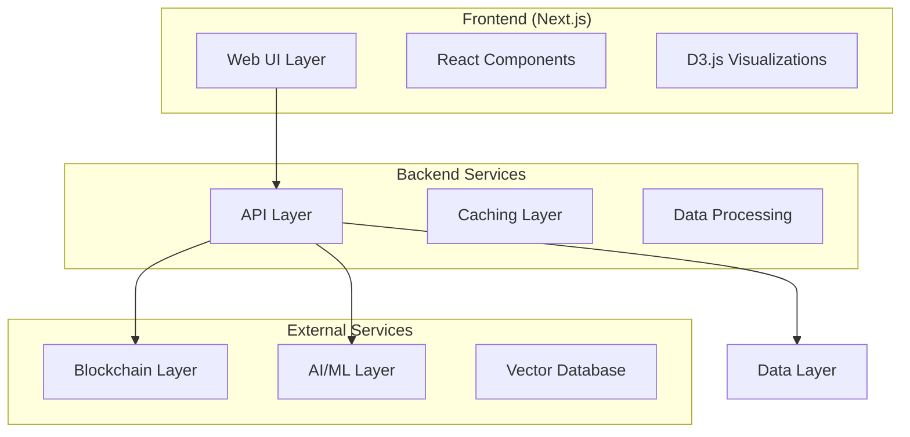

# OpenSVM Architecture Documentation

This directory contains comprehensive architectural documentation for the OpenSVM project, providing a centralized source of truth for system design, component relationships, and architectural decisions.

## 📋 Table of Contents

- [System Overview](./system-overview.md) - High-level system architecture and design
- [Component Architecture](./components.md) - Detailed component breakdown and relationships
- [Architecture Decision Records (ADRs)](./adr/) - Historical and current architectural decisions
- [Data Flow & Integration](./data-flow.md) - Data flow patterns and external integrations
- [Deployment Architecture](./deployment.md) - Infrastructure and deployment patterns
- [Performance & Scalability](./performance.md) - Performance considerations and optimization strategies
- [Security Architecture](./security.md) - Security measures and considerations
- [Development Guidelines](./development-guidelines.md) - Development standards and practices

## 🎯 Purpose

This documentation serves to:

- **Centralize architectural knowledge** previously scattered across agent notes and external documentation
- **Provide contextual architectural insights** directly linked to source code
- **Facilitate onboarding** for new developers and contributors
- **Maintain architectural consistency** across the codebase
- **Enable informed decision-making** during development and maintenance

## 🔗 Integration with Source Code

Key source files contain inline JSDoc comments that reference relevant sections of this documentation:

- **API Routes** (`/app/api/`) - Link to integration patterns and data flow docs
- **Core Components** (`/components/`) - Reference component architecture documentation
- **Library Code** (`/lib/`) - Point to relevant architectural patterns and decisions
- **Utility Functions** (`/utils/`) - Reference development guidelines and best practices

## 📚 How to Use This Documentation

1. **New Developers**: Start with [System Overview](./system-overview.md) to understand the overall architecture
2. **Feature Development**: Check [Component Architecture](./components.md) and relevant ADRs
3. **Infrastructure Changes**: Review [Deployment Architecture](./deployment.md) and [Performance](./performance.md) docs
4. **Code Reviews**: Reference [Development Guidelines](./development-guidelines.md) for consistency checks

## 🔄 Keeping Documentation Updated

This documentation should be updated when:

- New architectural decisions are made (add ADRs)
- Major components are added or modified
- Integration patterns change
- Performance characteristics are altered
- Security measures are updated

See [CONTRIBUTING.md](./CONTRIBUTING.md) for detailed guidelines on maintaining this documentation.

## 🏗️ Architecture at a Glance

## 🎨 Key Architectural Principles

- **Modularity**: Clear separation of concerns with well-defined interfaces
- **Scalability**: Designed for horizontal scaling and performance optimization
- **Maintainability**: Clean code architecture with comprehensive documentation
- **Extensibility**: Plugin-based architecture for adding new features
- **Performance**: Optimized for fast response times and efficient resource usage
- **Security**: Security-first design with proper access controls and data protection

---

*This documentation is maintained by the OpenSVM development team and updated regularly to reflect the current state of the system architecture.*