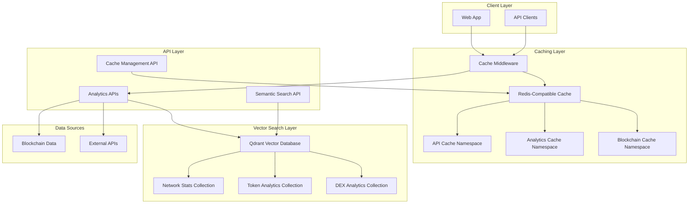

# Advanced Caching and Indexing Architecture

This document describes the advanced caching and indexing system implemented in OpenSVM to optimize API response times and enhance analytics performance.

## Overview

The caching system provides a multi-layer approach combining in-memory caching with intelligent invalidation strategies and vector-based indexing for semantic search capabilities.

### Key Components

1. **Redis-Compatible Cache Layer** - Multi-namespace memory cache with TTL support
2. **Cache Middleware** - Transparent caching for API endpoints
3. **Vector Search Integration** - Enhanced Qdrant collections for analytics data
4. **Cache Management API** - Monitoring and operational controls

## Architecture Diagram



## Cache Namespaces

### API Cache (`apiCache`)
- **Purpose**: General API responses
- **TTL**: 30 minutes default
- **Max Size**: 5,000 entries
- **Use Cases**: Account data, search results, program information

### Analytics Cache (`analyticsCache`)
- **Purpose**: Analytics and statistical data
- **TTL**: 15 minutes default
- **Max Size**: 2,000 entries
- **Use Cases**: Network statistics, token analytics, DeFi metrics

### Blockchain Cache (`blockchainCache`)
- **Purpose**: Immutable blockchain data
- **TTL**: 1 hour default
- **Max Size**: 10,000 entries
- **Use Cases**: Transaction data, block data, historical records

## Vector Search Collections

### Network Statistics Collection
```typescript
interface NetworkStatsEntry {
  id: string;
  timestamp: number;
  slot: number;
  tps: number;
  totalValidators: number;
  stakingRatio: number;
  epochInfo: EpochInfo;
  // ... additional fields
}
```

### Token Analytics Collection
```typescript
interface TokenAnalyticsEntry {
  id: string;
  mint: string;
  symbol: string;
  price?: number;
  volume24h?: number;
  marketCap?: number;
  liquidityPools: LiquidityPool[];
  // ... additional fields
}
```

## Cache Middleware Usage

### Basic Usage
```typescript
import { withCache, CACHE_CONFIGS } from '@/lib/cache/cache-middleware';

export const GET = withCache(CACHE_CONFIGS.TOKEN_ANALYTICS)(async (req) => {
  // Your API handler logic
  return NextResponse.json(data);
});
```

### Custom Configuration
```typescript
export const GET = withCache({
  ttl: 10 * 60 * 1000, // 10 minutes
  namespace: 'analytics',
  tags: ['custom', 'endpoint'],
  enableDebug: true,
  cacheKeyGenerator: (req) => `custom:${req.url}`
})(handler);
```

## Cache Invalidation Strategies

### Tag-Based Invalidation
```typescript
import { CacheInvalidator } from '@/lib/cache/cache-middleware';

// Invalidate all network-related data
await CacheInvalidator.invalidateByTags(['network', 'stats'], 'analytics');

// Invalidate specific token data
await CacheInvalidator.invalidateTokenData('So11111111111111111111111111111111111111112');
```

### Pattern-Based Invalidation
```typescript
// Invalidate all user-related cache entries
await CacheInvalidator.invalidateByPattern('user:*', 'api');

// Invalidate specific account data
await CacheInvalidator.invalidateAccountData('account-address');
```

### Event-Driven Invalidation
The system automatically invalidates relevant cache entries based on:
- New block confirmations
- Transaction status changes
- Token price updates
- Network parameter changes

## Performance Optimizations

### Cache-First Strategy
1. **Request arrives** → Check cache first
2. **Cache Hit** → Return cached data immediately
3. **Cache Miss** → Fetch from source, cache result, return data

### Intelligent TTL Management
- **Immutable Data**: Long TTL (24 hours) for transactions, blocks
- **Semi-Mutable Data**: Medium TTL (30 minutes) for account info
- **Volatile Data**: Short TTL (5 minutes) for network stats, prices

### Compression and Memory Management
- Automatic compression for large payloads
- LRU eviction when memory limits reached
- Background cleanup of expired entries

## Monitoring and Observability

### Cache Statistics API
```bash
# Get overall cache statistics
GET /api/cache

# Get Prometheus metrics
GET /api/cache?format=prometheus
```

### Response Headers
- `X-Cache`: HIT/MISS/ERROR status
- `X-Cache-Key`: Cache key used
- `X-Cache-Age`: Age of cached data in seconds
- `X-Response-Time`: Total response time

### Performance Metrics
- **Hit Rate**: Target >70% for typical workloads
- **Response Time**: 50% reduction for cached endpoints
- **Memory Usage**: Tracked per namespace
- **Eviction Rate**: Monitored for capacity planning

## Semantic Search Capabilities

### Network Statistics Search
```bash
# Search for network performance data
GET /api/analytics/search?q=high+tps+performance&type=network&limit=20

# Filter by time range and TPS
GET /api/analytics/search?q=network+congestion&type=network&start_time=1640995200&end_time=1640995200&min_value=2000
```

### Token Analytics Search
```bash
# Search for token data
GET /api/analytics/search?q=defi+tokens+high+volume&type=token&limit=50

# Filter by market cap
GET /api/analytics/search?q=solana+ecosystem+tokens&type=token&min_value=1000000
```

## Configuration

### Environment Variables
```bash
# Qdrant configuration
QDRANT_SERVER=http://localhost:6333
QDRANT_API_KEY=your-api-key

# Cache configuration
CACHE_ENABLED=true
CACHE_DEBUG=false
CACHE_DEFAULT_TTL=1800000
CACHE_MAX_MEMORY=500000000
```

### Cache Sizes and Limits
```typescript
const CACHE_CONFIG = {
  apiCache: {
    maxSize: 5000,
    ttl: 30 * 60 * 1000
  },
  analyticsCache: {
    maxSize: 2000,
    ttl: 15 * 60 * 1000
  },
  blockchainCache: {
    maxSize: 10000,
    ttl: 60 * 60 * 1000
  }
};
```

## Best Practices

### API Endpoint Design
1. **Identify cacheable endpoints**: Focus on read-heavy operations
2. **Set appropriate TTLs**: Balance freshness vs performance
3. **Use cache tags**: Enable selective invalidation
4. **Handle cache bypasses**: Support debugging and testing

### Data Modeling for Vector Search
1. **Rich text content**: Include relevant keywords in embeddings
2. **Structured metadata**: Use payload fields for filtering
3. **Batch operations**: Optimize ingestion performance
4. **Regular cleanup**: Maintain collection health

### Operational Considerations
1. **Monitor hit rates**: Aim for >70% cache hit rate
2. **Track memory usage**: Prevent memory exhaustion
3. **Regular maintenance**: Clean up expired entries
4. **Performance testing**: Validate cache effectiveness

## Troubleshooting

### Common Issues

#### Low Cache Hit Rate
- Check TTL settings (too short)
- Verify cache key consistency
- Monitor cache eviction rate
- Review invalidation patterns

#### High Memory Usage
- Reduce cache size limits
- Enable compression
- Implement more aggressive cleanup
- Optimize data structures

#### Stale Data Issues
- Review invalidation strategies
- Check event-driven invalidation
- Validate TTL settings
- Monitor data freshness

### Debug Commands
```bash
# View cache statistics
curl http://localhost:3000/api/cache

# Force cache cleanup
curl -X DELETE http://localhost:3000/api/cache/cleanup

# Invalidate specific patterns
curl -X POST http://localhost:3000/api/cache/invalidate \
  -H "Content-Type: application/json" \
  -d '{"pattern": "token:*", "namespace": "analytics"}'

# Flush all caches
curl -X POST http://localhost:3000/api/cache/invalidate \
  -H "Content-Type: application/json" \
  -d '{"type": "all"}'
```

## Future Enhancements

### Planned Features
1. **Redis Integration**: Replace memory cache with Redis for persistence
2. **Distributed Caching**: Support for multi-instance deployments
3. **Smart Prefetching**: Predictive cache warming
4. **Advanced Analytics**: ML-powered cache optimization
5. **GraphQL Support**: Enhanced caching for GraphQL queries

### Performance Targets
- **95% Cache Hit Rate**: For frequently accessed data
- **<100ms Response Time**: For cached endpoints
- **99.9% Availability**: With fallback mechanisms
- **Auto-scaling**: Based on traffic patterns

## Security Considerations

### Cache Isolation
- Namespace separation prevents cross-contamination
- User-specific data requires authentication checks
- Sensitive data excluded from caching

### Data Privacy
- No PII stored in cache keys
- Automatic expiration of sensitive data
- Audit logging for cache access

### Access Control
- Cache management APIs require authentication
- Read-only access for monitoring endpoints
- Administrative functions properly secured