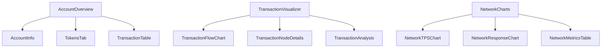

# Component Architecture Documentation

This document provides a comprehensive overview of the OpenSVM component architecture, detailing the structure, relationships, and responsibilities of all major components in the system.

## Overview

OpenSVM follows a modular component architecture with clear separation of concerns. Components are organized into logical groupings based on their functionality and domain responsibility.

## Component Hierarchy

```
OpenSVM Components
├── Pages (App Router)
│   ├── Account Pages
│   ├── Transaction Pages
│   ├── Block Pages
│   ├── Network Pages
│   └── Analytics Pages
├── Layout Components
│   ├── Navigation
│   ├── Footer
│   └── Sidebar
├── Feature Components
│   ├── Transaction Visualization
│   ├── Network Monitoring
│   ├── Account Management
│   ├── Token Analytics
│   ├── AI Assistant
│   └── Tokenomics System
├── Data Display Components
│   ├── Tables
│   ├── Charts
│   └── Grids
└── UI Components
    ├── Form Elements
    ├── Buttons
    ├── Modal/Dialog
    └── Utility Components
```

## Core Component Groups

### 1. Transaction Components

#### TransactionFlowChart.tsx
**Purpose**: Interactive visualization of transaction flows using D3.js
**Location**: `components/transaction-graph/`
**Architecture Reference**: [Transaction Visualization System](./system-overview.md#data-visualization-system)

```typescript
/**
 * Interactive transaction flow visualization component
 * @see docs/architecture/system-overview.md#data-visualization-system
 */
interface TransactionFlowChartProps {
  transactionData: TransactionData;
  onNodeClick: (node: TransactionNode) => void;
  layout: 'force' | 'hierarchical' | 'radial';
}
```

**Key Features**:
- Force-directed graph layout
- Interactive node dragging
- Dynamic relationship visualization
- Color-coded node types
- Real-time updates

**Dependencies**: D3.js, React, TypeScript

#### TransactionAnalysis.tsx
**Purpose**: Detailed transaction analysis and breakdown
**Location**: `components/transaction/`

```typescript
/**
 * Provides detailed analysis of transaction components
 * @see docs/architecture/components.md#transaction-components
 */
interface TransactionAnalysisProps {
  signature: string;
  showInnerInstructions: boolean;
  highlightPrograms: string[];
}
```

**Key Features**:
- Program invocation analysis
- Token transfer tracking
- Account state changes
- Error detection and reporting

#### EnhancedTransactionVisualizer.tsx
**Purpose**: Advanced multi-level transaction visualization
**Location**: `components/transaction-graph/`

**Key Features**:
- Multi-level transaction view
- Inner instruction visualization
- Program interaction flows
- State change tracking

### 2. Network Monitoring Components

#### NetworkCharts.tsx
**Purpose**: Network statistics visualization
**Location**: `components/network/`
**Architecture Reference**: [Performance Monitoring](./system-overview.md#monitoring-and-observability)

```typescript
/**
 * Network performance visualization component
 * @see docs/architecture/system-overview.md#monitoring-and-observability
 */
interface NetworkChartsProps {
  metrics: NetworkMetrics;
  timeRange: TimeRange;
  refreshInterval: number;
}
```

**Key Features**:
- TPS monitoring
- Block time tracking
- Network load visualization
- Historical trends

#### NetworkMetricsTable.tsx
**Purpose**: Tabular display of network metrics
**Location**: `components/network/`

**Key Features**:
- Real-time metrics
- Historical comparisons
- Performance indicators
- Alert thresholds

### 3. Account Management Components

#### AccountInfo.tsx
**Purpose**: Comprehensive account information display
**Location**: `components/account/`
**Architecture Reference**: [Account Management](./system-overview.md#blockchain-integration-layer)

```typescript
/**
 * Account information display component
 * @see docs/architecture/system-overview.md#blockchain-integration-layer
 */
interface AccountInfoProps {
  address: string;
  showTokens: boolean;
  showTransactions: boolean;
  showPrograms: boolean;
}
```

**Key Features**:
- Balance tracking
- Transaction history
- Token holdings
- Program interactions

#### TokensTab.tsx
**Purpose**: Token holdings and management
**Location**: `components/account/`

**Key Features**:
- Token list display
- Balance tracking
- Transfer history
- Value calculations

### 4. Data Display Components

#### TokenTable.tsx
**Purpose**: Sortable and filterable token data display
**Location**: `components/tables/`
**Architecture Reference**: [Performance Considerations](./system-overview.md#performance-considerations)

```typescript
/**
 * High-performance token data table with virtual scrolling
 * @see docs/architecture/system-overview.md#performance-considerations
 */
interface TokenTableProps {
  tokens: TokenData[];
  sortBy: string;
  filterBy: TokenFilter;
  onRowClick: (token: TokenData) => void;
}
```

**Key Features**:
- Sortable columns
- Advanced filtering
- Pagination
- Search functionality
- Virtual scrolling for large datasets

#### TransactionTable.tsx
**Purpose**: Transaction list display with advanced features
**Location**: `components/tables/`

**Key Features**:
- Transaction details
- Status tracking
- Time-based filtering
- Search capabilities

#### vtable.tsx
**Purpose**: Virtual table implementation for large datasets
**Location**: `components/tables/`

**Key Features**:
- Virtual scrolling
- Dynamic row height
- Column customization
- Performance optimization

### 5. UI Components

#### SearchBar.tsx
**Purpose**: Global search interface
**Location**: `components/ui/`
**Architecture Reference**: [User Interface](./system-overview.md#user-interface-layer)

```typescript
/**
 * Global search component with multi-type support
 * @see docs/architecture/system-overview.md#user-interface-layer
 */
interface SearchBarProps {
  placeholder: string;
  onSearch: (query: string, type: SearchType) => void;
  suggestions: SearchSuggestion[];
  recentSearches: string[];
}
```

**Key Features**:
- Auto-complete
- Multi-type search (addresses, transactions, blocks)
- Recent searches
- Search suggestions

#### ThemeSwitcher.tsx
**Purpose**: Theme management and switching
**Location**: `components/ui/`

**Key Features**:
- Light/dark mode toggle
- Theme persistence
- System preference synchronization

### 6. AI Assistant & Tokenomics Components

#### AIAssistant.tsx
**Purpose**: AI-powered blockchain analysis and query assistant
**Location**: `components/ai/`
**Architecture Reference**: [AI Integration System](./system-overview.md#svmai-tokenomics-system)

```typescript
/**
 * AI Assistant component with integrated tokenomics
 * 
 * @see docs/architecture/tokenomics.md
 * @see docs/architecture/adr/005-svmai-tokenomics-model.md
 */
export interface AIAssistantProps {
  userTier: TokenTier;
  tokenBalance: number;
  onPromptSubmit: (prompt: string) => Promise<void>;
}
```

**Key Features**:
- Natural language blockchain queries
- Real-time token balance verification
- Tiered pricing display and calculation
- Payment processing integration
- Context-aware blockchain analysis

#### TokenomicsDisplay.tsx
**Purpose**: User tier status and token balance visualization
**Location**: `components/tokenomics/`

**Key Features**:
- Real-time tier status display
- Token balance monitoring
- Cost calculator for AI services
- Upgrade prompts and benefit explanations
- Payment transaction history

#### PaymentProcessor.tsx
**Purpose**: Handles token payments for AI services
**Location**: `components/tokenomics/`
**Architecture Reference**: [Tokenomics Documentation](./tokenomics.md#payment-processing)

**Key Features**:
- Secure token deduction processing
- Transaction validation and confirmation
- Error handling and retry logic
- Payment history tracking
- Real-time balance updates

#### SocialGate.tsx
**Purpose**: Token-gated social feature access control
**Location**: `components/social/`

**Key Features**:
- 100k+ token requirement enforcement
- Social feature access validation
- Graceful degradation for insufficient tokens
- Community participation tracking

## Component Relationships

### Data Flow Patterns

#### 1. Parent-Child Relationships


#### 2. Shared State Management
Components share state through:
- **React Context**: Theme, user preferences, global configuration
- **Props Drilling**: Direct parent-child communication
- **Custom Hooks**: Shared logic and state management
- **Event Callbacks**: Component communication

#### 3. Component Communication Patterns

**Props Flow**:
```typescript
// Downward data flow
<TransactionFlowChart 
  transactionData={data}
  onNodeClick={handleNodeClick}
  layout="force"
/>

// Event callbacks
const handleNodeClick = (node: TransactionNode) => {
  setSelectedNode(node);
  fetchNodeDetails(node.id);
};
```

**Context Usage**:
```typescript
// Theme context
const { theme, setTheme } = useTheme();

// Network state
const { network, setNetwork } = useNetwork();

// Global configuration
const { config } = useConfig();
```

**Custom Hooks**:
```typescript
// Data fetching hook
const { data, loading, error } = useTransactionData(signature);

// State management hook
const { state, dispatch } = useTransactionState();

// Effect handling hook
const { subscribe, unsubscribe } = useRealTimeUpdates();
```

## Component Best Practices

### 1. Code Organization

**File Structure**:
```
components/
├── feature-components/
│   ├── transaction/
│   ├── network/
│   ├── account/
│   └── analytics/
├── shared/
│   ├── tables/
│   ├── charts/
│   └── forms/
├── layout/
│   ├── navigation/
│   ├── sidebar/
│   └── footer/
└── ui/
    ├── buttons/
    ├── inputs/
    └── modals/
```

**Component Patterns**:
- **Presentational Components**: Pure UI components without business logic
- **Container Components**: Components that manage state and data
- **Higher-Order Components**: Reusable component logic
- **Custom Hooks**: Shared stateful logic

### 2. Performance Optimizations

**Memoization**:
```typescript
const TransactionTable = memo(({ transactions, onRowClick }) => {
  const sortedTransactions = useMemo(
    () => sortTransactions(transactions),
    [transactions]
  );
  
  return (
    <div>
      {sortedTransactions.map(tx => (
        <TransactionRow 
          key={tx.signature}
          transaction={tx}
          onClick={onRowClick}
        />
      ))}
    </div>
  );
});
```

**Virtual Scrolling**:
```typescript
const VirtualizedTable = ({ data, itemHeight = 50 }) => {
  const [visibleItems, setVisibleItems] = useState([]);
  const [scrollTop, setScrollTop] = useState(0);
  
  // Virtual scrolling implementation
  // Only render visible items
};
```

### 3. Testing Strategy

**Unit Tests**:
```typescript
describe('TransactionFlowChart', () => {
  it('renders transaction nodes correctly', () => {
    render(<TransactionFlowChart transactionData={mockData} />);
    expect(screen.getByTestId('transaction-node')).toBeInTheDocument();
  });
  
  it('handles node click events', () => {
    const onNodeClick = jest.fn();
    render(<TransactionFlowChart onNodeClick={onNodeClick} />);
    fireEvent.click(screen.getByTestId('transaction-node'));
    expect(onNodeClick).toHaveBeenCalled();
  });
});
```

**Integration Tests**:
```typescript
describe('Account Page Integration', () => {
  it('displays account information with tokens', async () => {
    render(<AccountPage address={mockAddress} />);
    
    await waitFor(() => {
      expect(screen.getByText('Account Balance')).toBeInTheDocument();
      expect(screen.getByText('Token Holdings')).toBeInTheDocument();
    });
  });
});
```

## Accessibility Features

### 1. Keyboard Navigation
- Focus management
- Keyboard shortcuts
- Tab ordering
- ARIA support

### 2. Screen Reader Support
- Semantic HTML
- ARIA labels
- Alternative text
- Role definitions

### 3. Visual Accessibility
- Color contrast compliance
- Font scaling support
- Focus indicators
- Motion reduction preferences

## Error Handling

### Component-Level Error Boundaries
```typescript
class TransactionErrorBoundary extends Component {
  constructor(props) {
    super(props);
    this.state = { hasError: false };
  }
  
  static getDerivedStateFromError(error) {
    return { hasError: true };
  }
  
  componentDidCatch(error, errorInfo) {
    console.error('Transaction component error:', error, errorInfo);
  }
  
  render() {
    if (this.state.hasError) {
      return <ErrorFallback message="Failed to load transaction data" />;
    }
    
    return this.props.children;
  }
}
```

## Future Enhancements

### Planned Component Improvements
- **Enhanced Visualizations**: 3D transaction graphs, AR/VR support
- **Real-time Features**: WebSocket-based live updates
- **Advanced Analytics**: Machine learning-powered insights
- **Performance Optimizations**: Web Workers for heavy computations
- **Accessibility**: Enhanced screen reader support and keyboard navigation

---

*This component architecture documentation is maintained alongside the codebase. For implementation details, refer to the individual component files and their inline documentation.*