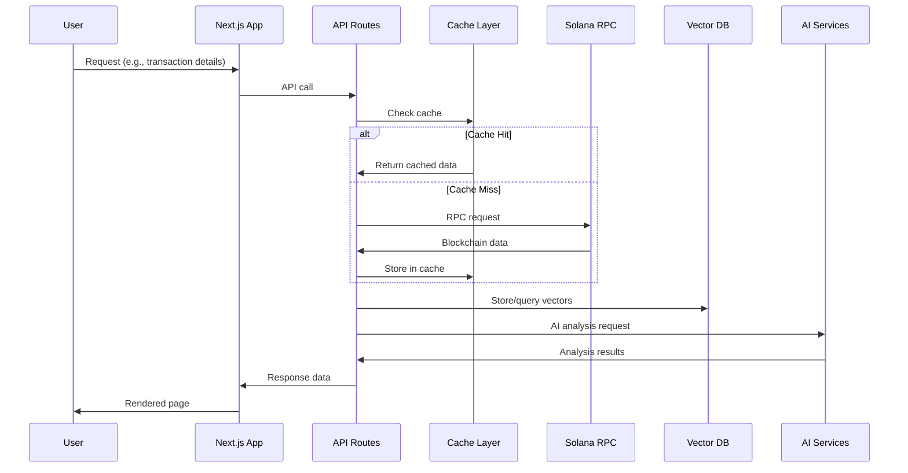
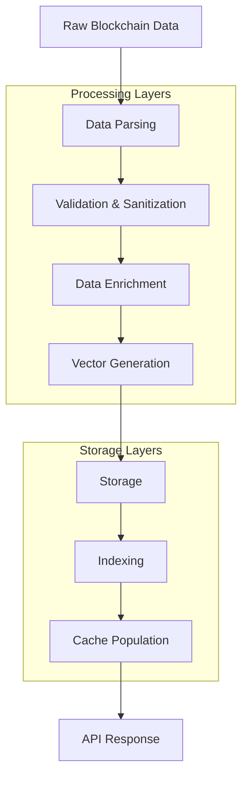
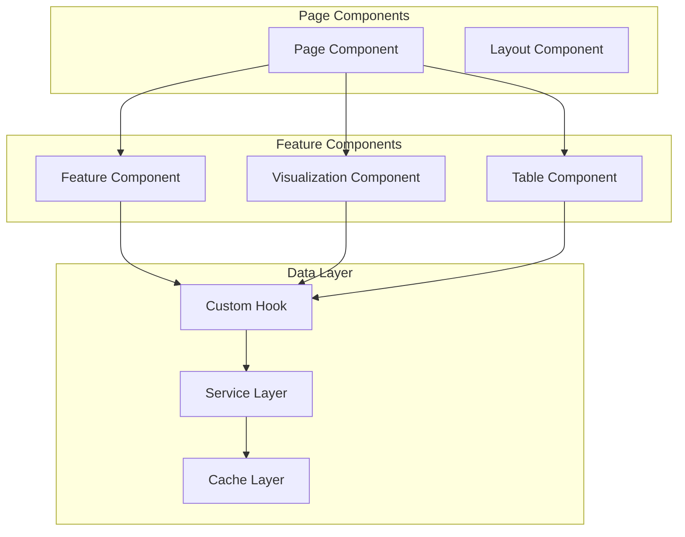
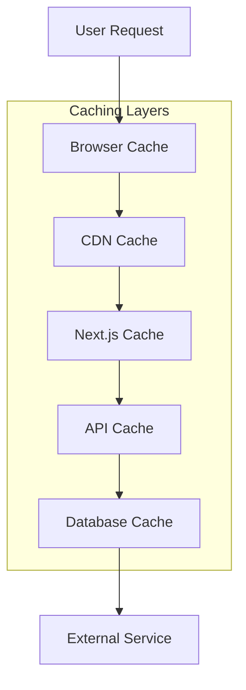
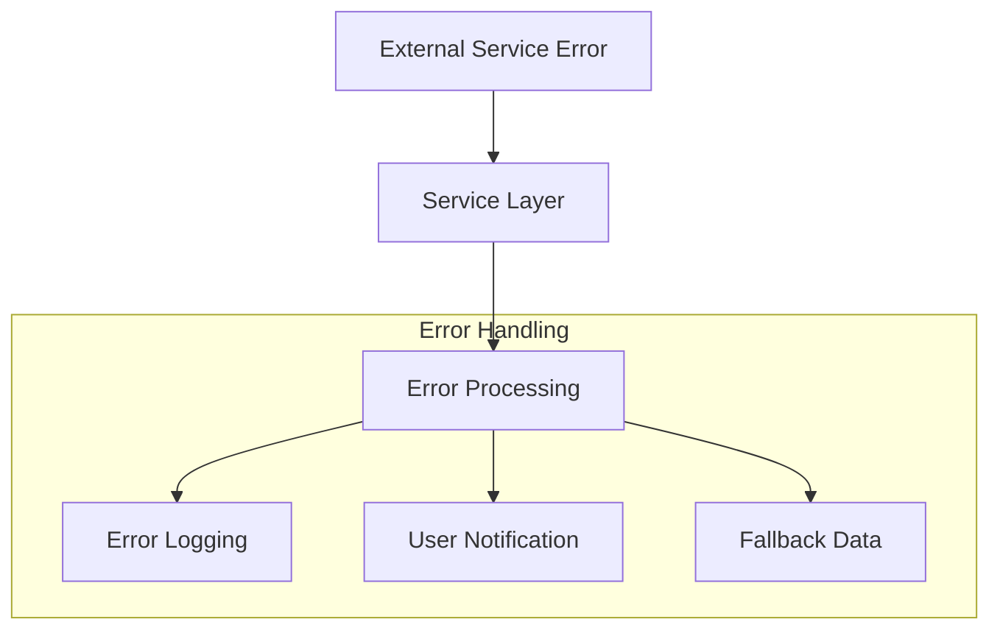

# Data Flow & Integration Architecture

This document describes the data flow patterns and external integrations in the OpenSVM system.

## Overview

OpenSVM processes blockchain data through multiple layers, transforming raw blockchain information into meaningful insights and visualizations. The system integrates with various external services to provide comprehensive blockchain analytics.

## Data Flow Architecture

### 1. Request Processing Flow



### 2. Data Processing Pipeline



## External Service Integrations

### 1. Solana RPC Integration

**Purpose**: Primary blockchain data source
**Data Flow**: Real-time blockchain data retrieval

```typescript
/**
 * Solana RPC integration patterns
 * @see docs/architecture/system-overview.md#blockchain-integration-layer
 */

// Connection management
const connection = getConnection();

// Account data retrieval
const accountData = await connection.getAccountInfo(publicKey);

// Transaction parsing
const transaction = await connection.getTransaction(signature);

// Block data retrieval
const block = await connection.getBlock(slot);
```

**Key Features**:
- Load balancing across multiple RPC endpoints
- Automatic retry logic for failed requests
- Request rate limiting and throttling
- Error handling and fallback mechanisms

### 2. Qdrant Vector Database

**Purpose**: Similarity search and knowledge graph storage
**Data Flow**: Vector storage and retrieval for relationship analysis

```typescript
/**
 * Qdrant integration for vector operations
 * @see docs/architecture/adr/001-vector-database-selection.md
 */

// Vector storage
await qdrantClient.upsert(collectionName, {
  points: [{
    id: transactionId,
    vector: transactionVector,
    payload: transactionMetadata
  }]
});

// Similarity search
const results = await qdrantClient.search(collectionName, {
  vector: queryVector,
  limit: 10,
  score_threshold: 0.8
});
```

**Integration Points**:
- Transaction pattern analysis
- Account relationship discovery
- Similar transaction finding
- Anomaly detection

### 3. AI Service Integration

**Purpose**: Natural language processing and analysis
**Data Flow**: AI-powered explanations and insights

```typescript
/**
 * AI service integration for blockchain analysis
 * @see docs/architecture/system-overview.md#ai-components
 */

// Transaction analysis
const analysis = await aiService.analyzeTransaction({
  transaction: transactionData,
  context: additionalContext
});

// Natural language explanation
const explanation = await aiService.explainTransaction({
  transaction: transactionData,
  userQuery: "What does this transaction do?"
});
```

**Features**:
- Transaction explanation generation
- Pattern recognition and analysis
- Natural language query processing
- Contextual blockchain insights

### 4. Flipside Crypto API

**Purpose**: Enhanced analytics and historical data
**Data Flow**: Additional blockchain analytics and metrics

```typescript
/**
 * Flipside Crypto API integration
 * @see docs/architecture/system-overview.md#external-integrations
 */

// Historical data retrieval
const historicalData = await flipsideAPI.query({
  sql: "SELECT * FROM solana.fact_transactions WHERE block_timestamp > '2024-01-01'"
});

// Analytics queries
const analytics = await flipsideAPI.getAnalytics({
  metric: 'daily_active_users',
  timeframe: '30d'
});
```

## Internal Data Flow Patterns

### 1. Component Data Flow



### 2. State Management Flow

```typescript
/**
 * State management patterns in OpenSVM
 * @see docs/architecture/components.md#component-communication
 */

// Global state (React Context)
const GlobalStateProvider = ({ children }) => {
  const [networkState, setNetworkState] = useState();
  const [userPreferences, setUserPreferences] = useState();
  
  return (
    <GlobalStateContext.Provider value={{
      networkState, setNetworkState,
      userPreferences, setUserPreferences
    }}>
      {children}
    </GlobalStateContext.Provider>
  );
};

// Local state management
const TransactionPage = () => {
  const [transactionData, setTransactionData] = useState();
  const [loading, setLoading] = useState(true);
  
  // Data fetching with custom hook
  const { data, error } = useTransactionData(signature);
  
  return (
    <TransactionDetails 
      data={data}
      onUpdate={setTransactionData}
    />
  );
};
```

## Caching Strategy

### 1. Multi-Layer Caching



### 2. Cache Implementation

```typescript
/**
 * Caching implementation across different layers
 * @see docs/architecture/system-overview.md#performance-considerations
 */

// API-level caching
const apiCache = new Map();

async function getCachedData(key: string, fetcher: () => Promise<any>) {
  const cached = apiCache.get(key);
  
  if (cached && Date.now() - cached.timestamp < CACHE_TTL) {
    return cached.data;
  }
  
  const data = await fetcher();
  apiCache.set(key, { data, timestamp: Date.now() });
  
  return data;
}

// Component-level caching
const TransactionComponent = ({ signature }) => {
  const cachedData = useMemo(() => {
    return expensiveDataTransformation(rawData);
  }, [rawData]);
  
  return <TransactionView data={cachedData} />;
};
```

## Error Handling Patterns

### 1. Error Propagation Flow



### 2. Error Handling Implementation

```typescript
/**
 * Error handling patterns for external integrations
 * @see docs/architecture/system-overview.md#error-handling
 */

// Service-level error handling
class SolanaService {
  async getAccountData(address: string): Promise<AccountData | null> {
    try {
      const accountInfo = await this.connection.getAccountInfo(
        new PublicKey(address)
      );
      return this.processAccountData(accountInfo);
    } catch (error) {
      console.error('Failed to fetch account data:', error);
      
      // Try fallback RPC endpoint
      return await this.getAccountDataWithFallback(address);
    }
  }
  
  private async getAccountDataWithFallback(address: string) {
    // Fallback implementation
  }
}

// Component-level error handling
const TransactionDetails = ({ signature }) => {
  const { data, error, loading } = useTransactionData(signature);
  
  if (error) {
    return (
      <ErrorBoundary>
        <ErrorMessage 
          message="Failed to load transaction data"
          onRetry={() => window.location.reload()}
        />
      </ErrorBoundary>
    );
  }
  
  if (loading) {
    return <LoadingSpinner />;
  }
  
  return <TransactionView data={data} />;
};
```

## Performance Optimization

### 1. Data Loading Optimization

```typescript
/**
 * Performance optimization patterns
 * @see docs/architecture/performance.md
 */

// Lazy loading for large datasets
const VirtualizedTable = ({ data }) => {
  const [visibleItems, setVisibleItems] = useState([]);
  
  useEffect(() => {
    const observer = new IntersectionObserver((entries) => {
      // Load data as items come into view
    });
    
    return () => observer.disconnect();
  }, []);
  
  return (
    <div>
      {visibleItems.map(item => (
        <TableRow key={item.id} data={item} />
      ))}
    </div>
  );
};

// Batch operations for better performance
const BatchProcessor = {
  async processTransactions(signatures: string[]) {
    const BATCH_SIZE = 100;
    const results = [];
    
    for (let i = 0; i < signatures.length; i += BATCH_SIZE) {
      const batch = signatures.slice(i, i + BATCH_SIZE);
      const batchResults = await Promise.all(
        batch.map(sig => this.processTransaction(sig))
      );
      results.push(...batchResults);
    }
    
    return results;
  }
};
```

## Real-time Data Flow

### 1. WebSocket Integration

```typescript
/**
 * Real-time data integration patterns
 * @see docs/architecture/system-overview.md#real-time-processing
 */

// WebSocket connection management
class RealTimeService {
  private ws: WebSocket | null = null;
  
  connect() {
    this.ws = new WebSocket(process.env.NEXT_PUBLIC_WS_URL);
    
    this.ws.onmessage = (event) => {
      const data = JSON.parse(event.data);
      this.handleRealTimeUpdate(data);
    };
  }
  
  private handleRealTimeUpdate(data: any) {
    // Update local state
    // Trigger component re-renders
    // Update caches
  }
}

// Component integration
const RealTimeTransactionFeed = () => {
  const [transactions, setTransactions] = useState([]);
  
  useEffect(() => {
    const realTimeService = new RealTimeService();
    realTimeService.connect();
    
    realTimeService.onUpdate((newTransaction) => {
      setTransactions(prev => [newTransaction, ...prev.slice(0, 99)]);
    });
    
    return () => realTimeService.disconnect();
  }, []);
  
  return (
    <TransactionList transactions={transactions} />
  );
};
```

## Data Validation and Security

### 1. Input Validation

```typescript
/**
 * Data validation patterns for external integrations
 * @see docs/architecture/security.md
 */

// Schema validation
import { z } from 'zod';

const TransactionSchema = z.object({
  signature: z.string().length(88),
  slot: z.number().positive(),
  blockTime: z.number().nullable(),
  meta: z.object({
    err: z.null(),
    fee: z.number(),
    // ... other fields
  })
});

// Validation middleware
async function validateTransactionData(data: unknown) {
  try {
    return TransactionSchema.parse(data);
  } catch (error) {
    console.error('Invalid transaction data:', error);
    throw new Error('Invalid transaction data format');
  }
}
```

## Monitoring and Observability

### 1. Data Flow Monitoring

```typescript
/**
 * Monitoring and observability patterns
 * @see docs/architecture/system-overview.md#monitoring-and-observability
 */

// Request tracing
class RequestTracer {
  static trace(operationName: string, metadata: any) {
    const startTime = Date.now();
    
    return {
      finish: (result?: any, error?: Error) => {
        const duration = Date.now() - startTime;
        
        console.log({
          operation: operationName,
          duration,
          success: !error,
          metadata,
          result: result ? 'success' : 'error',
          error: error?.message
        });
      }
    };
  }
}

// Usage in service calls
async function fetchTransactionData(signature: string) {
  const trace = RequestTracer.trace('fetchTransactionData', { signature });
  
  try {
    const data = await solanaService.getTransaction(signature);
    trace.finish(data);
    return data;
  } catch (error) {
    trace.finish(null, error);
    throw error;
  }
}
```

---

*This data flow documentation describes the current architecture and should be updated as integration patterns evolve.*