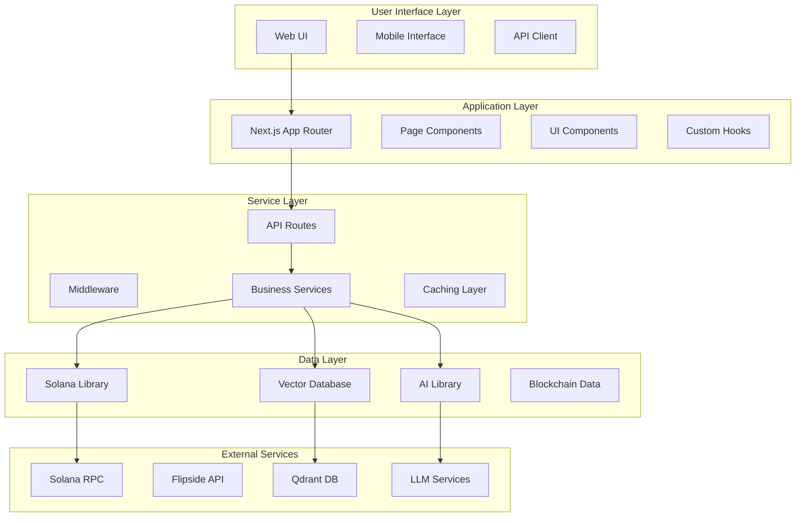

# OpenSVM System Architecture Overview

## Introduction

OpenSVM is a sophisticated Solana blockchain visualization and monitoring platform that provides comprehensive insights into transactions, blocks, accounts, programs, and tokens on the Solana blockchain. The system is designed with a modern, scalable architecture that emphasizes performance, maintainability, and extensibility.

## Technology Stack

### Frontend Layer
- **Framework**: Next.js 14 with App Router
- **Language**: TypeScript for type safety
- **Styling**: Tailwind CSS, CSS Modules
- **State Management**: React Context, Local State
- **Data Visualization**: D3.js, Cytoscape, Three.js, Chart.js
- **Testing**: Jest, Playwright

### Backend Services
- **API**: Next.js API Routes
- **Database**: Qdrant Vector Database
- **Blockchain**: Solana Web3.js, SPL Token
- **AI/ML**: Together AI, LLM integration
- **State Management**: XState for complex workflows

### External Integrations
- **Blockchain**: Solana RPC nodes
- **Analytics**: Flipside Crypto API
- **Vector Search**: Qdrant
- **Monitoring**: Custom analytics services

## High-Level Architecture

## Core Systems

### 1. Blockchain Integration Layer

The blockchain integration layer provides direct communication with Solana RPC endpoints and handles all blockchain-related operations.

**Key Components:**
- **Solana Connection Manager**: Manages RPC connections and load balancing
- **Transaction Parser**: Analyzes and parses Solana transactions
- **Account Manager**: Handles account data retrieval and management
- **Token Operations**: Manages SPL token interactions
- **Program Interface**: Facilitates interaction with Solana programs

**Features:**
- Direct Solana RPC communication
- Transaction parsing and analysis
- Account management
- Token operations
- Program interaction
- Error handling and retry logic

### 2. Knowledge Graph Engine

The knowledge graph engine uses vector-based relationship modeling to analyze blockchain data and discover patterns.

**Key Components:**
- **Vector Embedding**: Converts blockchain data into vector representations
- **Similarity Search**: Identifies similar transactions and patterns
- **Relationship Discovery**: Finds connections between blockchain entities
- **Graph Construction**: Builds and maintains knowledge graphs
- **Pattern Recognition**: Identifies common patterns and anomalies

**Features:**
- Vector-based relationship modeling
- Transaction pattern analysis
- Similarity search capabilities
- Graph construction and storage
- Pattern recognition algorithms

### 3. Data Visualization System

The visualization system provides interactive and dynamic representations of blockchain data.

**Key Components:**
- **Transaction Flow Visualizer**: Shows transaction flows and relationships
- **Network Metrics Display**: Visualizes network performance data
- **Account Relationship Graphs**: Displays account connections
- **Performance Charts**: Shows system and network performance
- **Real-time Updates**: Provides live data visualization

**Features:**
- Interactive transaction flows
- Network metrics visualization
- Account relationship graphs
- Performance charts
- Real-time updates

### 4. API Infrastructure

The API infrastructure handles all external requests and provides a consistent interface for data access.

**Key Components:**
- **RESTful Endpoints**: Standardized API endpoints
- **Rate Limiting**: Prevents abuse and ensures fair usage
- **Caching Strategy**: Optimizes response times
- **Error Handling**: Provides consistent error responses
- **Response Formatting**: Standardizes API responses

**Features:**
- RESTful endpoints
- Rate limiting
- Comprehensive caching strategy
- Robust error handling
- Consistent response formatting

### 5. $SVMAI Tokenomics System

The tokenomics system manages the native $SVMAI token economics, implementing a tiered pricing model for AI services and token-gated social features.

**Key Components:**
- **Token Balance Verification**: Real-time token balance checking and tier assignment
- **Payment Processing**: Automated token deduction and transaction processing
- **Tier Management**: Dynamic tier assignment based on token holdings
- **Access Control**: Token-gated feature access implementation
- **Burn Mechanism**: Token burning for deflationary economics

**Features:**
- Tiered pricing for AI assistant services (1-200 tokens per prompt)
- Social feature access gating (100k+ token requirement)
- Real-time balance monitoring and tier adjustments
- Secure payment processing and token burns
- User-friendly tier visualization and cost calculation

**Pricing Structure:**
- **Platinum Tier** (1M+ tokens): 1 $SVMAI per AI prompt
- **Gold Tier** (100k+ tokens): 10 $SVMAI per AI prompt  
- **Silver Tier** (< 100k tokens): 100 $SVMAI per AI prompt
- **Guest Users** (0 tokens): 200 $SVMAI per AI prompt

*For detailed tokenomics information, see [Tokenomics Documentation](./tokenomics.md) and [ADR-005: $SVMAI Tokenomics Model](./adr/005-svmai-tokenomics-model.md).*

## Data Flow Architecture

### Request Flow
1. **User Request**: User interacts with the web interface
2. **Next.js Routing**: App Router handles the request
3. **API Processing**: API routes process the request
4. **Service Layer**: Business logic handles the operation
5. **Data Access**: External services provide data
6. **Response**: Formatted data returns to the client

### Data Processing Pipeline
1. **Raw Data Ingestion**: Blockchain data from Solana RPC
2. **Data Parsing**: Transaction and account data parsing
3. **Vector Processing**: Data converted to vector embeddings
4. **Storage**: Processed data stored in vector database
5. **Analysis**: Pattern recognition and relationship discovery
6. **Visualization**: Data presented through interactive components

## Performance Considerations

### Optimization Strategies
- **Caching**: Multi-layer caching for API responses and data
- **Lazy Loading**: Components and data loaded on demand
- **Virtual Scrolling**: Efficient handling of large datasets
- **Memoization**: React memoization for expensive computations
- **Code Splitting**: Optimized bundle sizes

### Scalability Features
- **Horizontal Scaling**: Designed for distributed deployment
- **Load Balancing**: RPC connection load balancing
- **Database Optimization**: Efficient vector database queries
- **Resource Management**: Optimized resource utilization

## Security Architecture

### Security Measures
- **Input Validation**: Comprehensive input sanitization
- **Rate Limiting**: API abuse prevention
- **Error Handling**: Secure error responses
- **Data Encryption**: Sensitive data protection
- **Access Control**: Role-based access where applicable

### Best Practices
- **Secure Communication**: HTTPS for all communications
- **Environment Variables**: Secure configuration management
- **Dependency Management**: Regular security updates
- **Audit Logging**: Comprehensive logging for security monitoring

## Integration Points

### External Service Integration
- **Solana RPC**: Primary blockchain data source
- **Flipside Crypto**: Advanced analytics data
- **Qdrant**: Vector database for similarity search
- **Together AI**: LLM services for AI features

### Internal Service Communication
- **API Routes**: Standardized internal APIs
- **Service Layer**: Business logic abstraction
- **Data Layer**: Consistent data access patterns
- **Component Communication**: Props and context-based communication

## Deployment Architecture

### Environment Configuration
- **Development**: Local development with hot reloading
- **Staging**: Testing environment with production-like setup
- **Production**: Optimized production deployment

### Infrastructure Components
- **Web Server**: Next.js production server
- **Load Balancer**: Request distribution
- **Database**: Vector database deployment
- **Monitoring**: Performance and error monitoring

## Monitoring and Observability

### Monitoring Components
- **Performance Metrics**: Response times and throughput
- **Error Tracking**: Comprehensive error monitoring
- **Usage Analytics**: User behavior and feature usage
- **System Health**: Infrastructure monitoring

### Logging Strategy
- **Structured Logging**: Consistent log format
- **Log Levels**: Appropriate logging levels
- **Error Reporting**: Detailed error information
- **Audit Trails**: Security and compliance logging

## Future Architecture Considerations

### Scalability Enhancements
- **Microservices**: Potential service decomposition
- **CDN Integration**: Global content delivery
- **Edge Computing**: Edge-based processing
- **Database Sharding**: Horizontal database scaling

### Technology Evolution
- **New Blockchain Support**: Additional blockchain integration
- **AI/ML Enhancement**: Advanced machine learning features
- **Real-time Processing**: Enhanced real-time capabilities
- **Performance Optimization**: Continuous performance improvements

---

*This document provides a comprehensive overview of the OpenSVM system architecture. For detailed information about specific components, refer to the [Component Architecture](./components.md) documentation.*