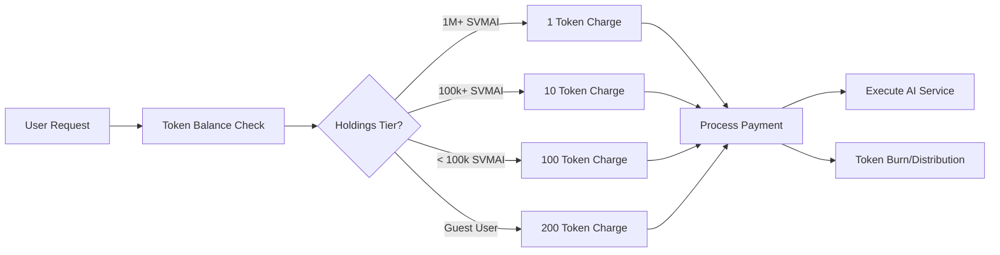

# $SVMAI Tokenomics

## Overview

The $SVMAI token serves as the native utility token for the OpenSVM platform, enabling access to premium features, AI assistant services, and social functionalities. The tokenomics model is designed to incentivize long-term holding while providing accessible entry points for all users.

## Token Utility

### Social Features Access
- **Minimum Requirement**: 100,000 $SVMAI tokens
- **Purpose**: Access to community features, social interactions, and collaborative tools
- **Benefits**: Voting rights, community governance participation, and premium social features

### AI Assistant & Agent Services

The platform implements a tiered pricing model based on token holdings for AI assistant and agent services:

#### Pricing Structure (Per Prompt)

| User Category | Token Holdings | Cost per Prompt |
|---------------|----------------|-----------------|
| **Platinum Tier** | 1,000,000+ $SVMAI | 1 $SVMAI |
| **Gold Tier** | 100,000+ $SVMAI | 10 $SVMAI |
| **Silver Tier** | < 100,000 $SVMAI | 100 $SVMAI |
| **Guest Users** | 0 $SVMAI | 200 $SVMAI |

#### Service Coverage

AI services include:
- **Transaction Analysis**: Advanced blockchain transaction pattern analysis
- **Smart Contract Insights**: Automated contract vulnerability and optimization suggestions
- **Portfolio Management**: AI-driven portfolio optimization and risk assessment
- **Market Intelligence**: Real-time market analysis and trading insights
- **Code Generation**: Solana program development assistance
- **Query Assistance**: Natural language blockchain data queries

## Economic Model

### Incentive Structure

1. **Long-term Holding Rewards**: Significant cost reductions for larger token holders
2. **Accessibility**: Multiple entry points prevent exclusion while rewarding commitment
3. **Utility-Driven Demand**: Token usage for core platform features creates sustained demand
4. **Guest Access**: Ensures platform accessibility for evaluation and onboarding

### Token Burn Mechanism

- **Service Payments**: A percentage of tokens paid for AI services are burned, creating deflationary pressure
- **Fee Distribution**: Remaining tokens are distributed to platform development and ecosystem rewards

## Implementation Architecture

### Payment Processing

### Integration Points

- **Wallet Connection**: Seamless integration with Solana wallets for token balance verification
- **Real-time Pricing**: Dynamic pricing calculation based on current token holdings
- **Payment Gateway**: Automated token deduction and transaction processing
- **Balance Monitoring**: Continuous monitoring of user token balances for tier adjustments

## Technical Implementation

### Smart Contract Features

- **Balance Verification**: Real-time token balance checking
- **Tier Management**: Automated tier assignment based on holdings
- **Payment Processing**: Secure token transfer and burning mechanisms
- **Access Control**: Token-gated feature access implementation

### Frontend Integration

- **Tier Display**: Visual indicators of user tier and benefits
- **Cost Calculator**: Real-time cost calculation for AI services
- **Balance Tracking**: Live token balance monitoring
- **Upgrade Prompts**: Suggestions for tier upgrades with benefit explanations

## Security Considerations

### Token Safety
- **Multi-signature Wallets**: Enhanced security for large token holders
- **Rate Limiting**: Protection against excessive service usage
- **Fraud Prevention**: Monitoring for suspicious token movement patterns

### Access Control
- **Time-based Verification**: Regular token balance re-verification
- **Graceful Degradation**: Smooth tier transitions when token balances change
- **Emergency Protocols**: Service suspension capabilities for security incidents

## Future Enhancements

### Planned Features
- **Staking Rewards**: Additional benefits for token staking
- **Governance Voting**: Weighted voting based on token holdings
- **Partner Integrations**: Cross-platform token utility
- **Advanced Analytics**: Tokenomics performance metrics and optimization

### Expansion Opportunities
- **Enterprise Tiers**: Custom pricing for institutional users
- **Developer Incentives**: Token rewards for platform contributors
- **Ecosystem Partnerships**: Token utility across partner platforms
- **Cross-chain Integration**: Multi-blockchain token utility

## Monitoring & Analytics

### Key Metrics
- **Token Distribution**: Tracking of tokens across user tiers
- **Service Usage**: Analysis of AI service consumption patterns
- **Burn Rate**: Monitoring of token burn velocity and economic impact
- **User Behavior**: Tier migration patterns and feature adoption

### Reporting
- **Daily Reports**: Token circulation and burn statistics
- **Tier Analysis**: User distribution across holding tiers
- **Revenue Tracking**: Token-based revenue generation metrics
- **Economic Health**: Overall tokenomics model performance indicators