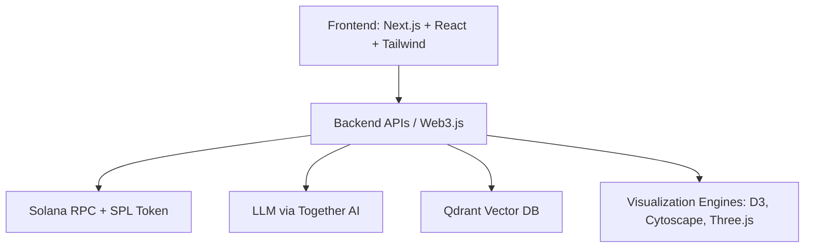

# OpenSVM Developer Onboarding Guide 🚀

Welcome to **OpenSVM** – the Solana Virtual Machine Explorer.  
This guide is designed to get you productive quickly, help you understand the architecture, and give you the tools to contribute effectively.

---

## 📖 Project Overview & Vision
OpenSVM is an **open-source virtual machine explorer** for the Solana blockchain.  
It combines:
- **Blockchain data** (transactions, contracts, SPL tokens)
- **AI-powered insights** (via Together AI and LLMs)
- **Rich interactive visualizations** (using D3.js, Cytoscape, Three.js, Chart.js)

**Goal:** To make Solana programs and transactions **transparent, explorable, and developer-friendly** through an integrated VM explorer.

---
## ⚡ Quickstart in 5 Minutes
For experienced devs who just want to get it running:

```bash
git clone https://github.com/aldrin-labs/opensvm.git
cd opensvm
pnpm install
pnpm dev

Visit 👉 http://localhost:3000 (or the port you configured)

```

## 🏗️ Architecture & System Design
### High-Level System



### Codebase Layout
- apps/web         → Frontend (Next.js + React)
- packages/core    → Core VM logic, Solana program parsing
- packages/ai      → AI integrations (Together AI, Qdrant)
- packages/viz     → Visualization (D3, Cytoscape, Chart.js, Three.js)
- tests/           → Playwright + Jest tests

### 📂 Code Walkthrough

- Transaction Parsing: Uses @debridge-finance/solana-transaction-parser
- AI Layer: LLMs from @mlc-ai/web-llm + Together AI APIs
- Visualizations: Graphs (D3.js), network maps (Cytoscape.js), 3D exploration (Three.js)
- State Machines: Workflow logic modeled with XState
- Data Store: Semantic embeddings stored in Qdrant

### Key Components

1. Frontend: Next.js + React + TailwindCSS
2. Blockchain Integration: Solana Web3.js, SPL Token
3. AI Components: LLMs via Together AI, MLC.ai for in-browser inference
4. Vector DB: Qdrant for semantic search and embeddings
5. Visualization: D3.js, Cytoscape, Three.js, Chart.js
6. Workflow Orchestration: XState for complex workflows    

## ⚙️ Development Environment Setup
### Prerequisites

- Node.js v18+

- pnpm (npm install -g pnpm)

- Rust + Solana CLI (for on-chain tooling)

- Git + Cursor IDE / VSCode

### Clone, Install and run
```
git clone https://github.com/aldrin-labs/opensvm.git
cd opensvm
pnpm install
```

### Run Locally
``` pnpm dev ```

### Run Tests
``` pnpm test ```

## 🧑‍💻 Coding Standards & Best Practices

- Language: TypeScript (strict mode enabled)

- Linting: ESLint + Prettier (pnpm lint)

- Commits: Conventional commits (e.g., feat: add token gating)

- PRs: Small, focused PRs with clear descriptions

- Docs: Every new feature should update /docs

## ✅ Testing Strategy & Tools

1. Unit tests with Jest

2. E2E tests with Playwright

3. CI checks: lint + build + test on every PR

## 🚀 Deployment & Release

- Preview builds on Vercel

- CI/CD via GitHub Actions

- Tagged releases auto-deployed

## 🛠️  Troubleshooting

⚠️ Common Issues developers face when setting up OpenSVM locally

1. Port Already in Use (3000)
- Symptom: App won’t start, error about port 3000.
- Fix (Linux/Mac): bash command
 ``` kill -9 $(lsof -ti:3000) ```
- Fix (Windows PowerShell):
``` Stop-Process -Id (Get-NetTCPConnection -LocalPort 3000).OwningProcess ```

2. Solana RPC Errors
- Symptom: Calls to Solana RPC fail with “connection refused” or “invalid endpoint.”
- Fix: Ensure your CLI is configured:

``` solana config get
solana config set --url https://api.devnet.solana.com
```

3. Build or Install Issues
- Symptom: Project fails during pnpm install or pnpm dev.
- Fix: 
```
pnpm clean
pnpm install
```

4. PNPM Not Found on Windows
- Symptom: Running pnpm gives “command not recognized.”
- Cause: PNPM wasn’t added to your PATH environment variable.
- Fix: 
1. Locate PNPM binary, usually in:
C:\Users\<YourUser>\AppData\Roaming\npm
2. Add this folder to your System Environment Variables → PATH.
3. Restart PowerShell or your IDE, then run:
``` pnpm -v ```
to confirm installation.

5. Missing .env.local File
- Symptom: App boots but fails with missing environment variables.
- Fix:
1. Copy the provided .env.example to .env.local:
cp .env.example .env.local
2. Open .env.local and update values (e.g., TOGETHER_API_KEY, Solana RPC endpoints).
3. Restart the dev server:
pnpm dev


### Example .env.local for OpenSVM (only to run locally)

One of these is required for search

SERPER_API_KEY=demo


TOGETHER_API_KEY=demo
HELICONE_API_KEY=demo
BIRDEYE_API_KEY=demo


OPENSVM_RPC_LIST=https://mainnet.infura.io/v3/demo
OPENSVM_RPC_LIST_2=https://rpc.ankr.com/eth


QDRANT=demo-qdrant-key
QDRANT_SERVER=https://your-qdrant-instance.qdrant.tech


DEBUG=false
LOG_LEVEL=error

### Example .env.local for OpenSVM 


NEXT_PUBLIC_SOLANA_RPC=https://api.mainnet-beta.solana.com


NEXT_PUBLIC_SOLANA_RPC_DEV=http://127.0.0.1:8899


NEXT_PUBLIC_QDRANT_URL=http://localhost:6333

TOGETHER_API_KEY=your_together_ai_api_key_here


## 🤝 Contribution Workflow

flowchart LR
  1. A[Fork Repo] --> B[Clone Locally]
  2. B --> C[Create Feature Branch]
  3. C --> D[Write Code + Docs]
  4. D --> E[Run Tests + Lint]
  5. E --> F[Push to Fork]
  6. F --> G[Open PR]
  7. G --> H[Review & Merge]

Steps:

1. Fork repo
2. Create branch: git checkout -b feat/my-feature
3. Commit using conventional commits
4. Push branch → open PR to main
5. Request review from maintainers

## 💻 Example Code Snippets

### Fetch Balance (Solana Web3.js)
```
import { Connection, clusterApiUrl, PublicKey } from "@solana/web3.js";

const connection = new Connection(clusterApiUrl("devnet"), "confirmed");

async function getBalance(pubKeyStr: string) {
  const pubKey = new PublicKey(pubKeyStr);
  const balance = await connection.getBalance(pubKey);
  console.log(`Balance: ${balance / 1e9} SOL`);
}

getBalance("YourPublicKeyHere");
```
###Query LLM (Together AI)
```
import Together from "together-ai";

const together = new Together({ apiKey: process.env.TOGETHER_API_KEY });

const response = await together.completions.create({
  model: "openai/gpt-oss-120b",
  prompt: "Summarize this Solana transaction in simple terms:",
});

console.log(response.output[0].text);
```

## 📚 Useful Resources

- Solana Web3.js Docs

- Together AI

- Qdrant Vector DB

- D3.js

- Cytoscape.js

## 🔄 Maintenance & Ownership

- Docs owned by @aldrin-labs/opensvm-maintainers

- Updating docs is part of the Definition of Done for features

- Review cycle: quarterly or after major changes

- documentation issues must be triaged within 7 days

##  Checklist for New Developers

 - ✅ Set up dev environment

 - ✅ Run the app locally

 - ✅ Explore /packages to understand modules

 - ✅ Run tests successfully

 - ✅ Read contribution guidelines

 - ✅ Open first “Good First Issue” PR 🎉

 ## 🧪 Testing the Docs

- Validate on a clean machine (new clone, fresh environment)

- Run all setup commands and tests

- Confirm all links work (lint + link check in CI)
