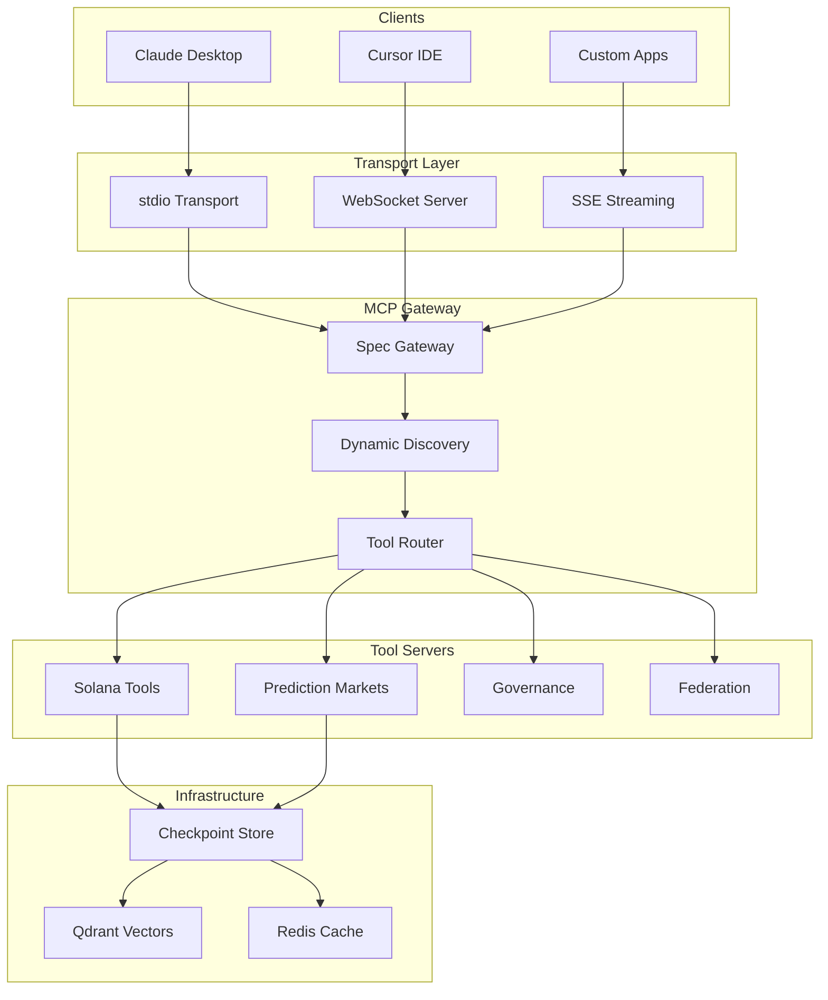
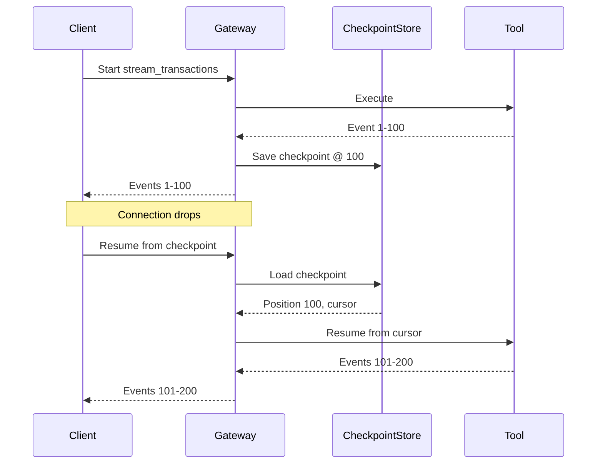
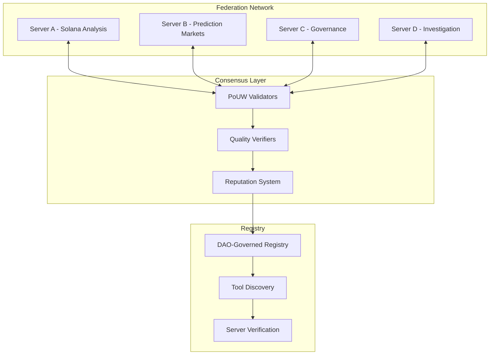

# OpenSVM MCP Platform: Building the Infrastructure for AI-Native Blockchain Tools

We're excited to announce the release of the **OpenSVM MCP Platform** - a comprehensive Model Context Protocol (MCP) server implementation that brings AI-powered blockchain analysis to any MCP-compatible client. This release includes 100+ tools across 15 specialized servers, real-time streaming, and a decentralized federation architecture.

## What is MCP?

The Model Context Protocol (MCP) is an open standard that enables AI assistants like Claude to interact with external tools and data sources. Think of it as a universal API that AI models can use to take actions in the real world - fetching data, executing trades, or analyzing complex systems.

With OpenSVM's MCP implementation, any MCP-compatible AI client can now:
- Query Solana blockchain data in real-time
- Execute complex multi-step investigations
- Stream live transaction feeds
- Interact with prediction markets
- Participate in decentralized governance

## Architecture Overview



## Core Components

### 1. Transport Layer

The platform supports three transport mechanisms:

**stdio Transport** - Standard input/output for CLI integration
```typescript
// Connect via Claude Desktop or command line
const transport = new StdioServerTransport();
await server.connect(transport);
```

**WebSocket Transport** - Real-time bidirectional communication for browser clients
```typescript
const gateway = new MCPWebSocketGateway({
  port: 8080,
  heartbeatIntervalMs: 30000,
  maxClients: 100
});
```

**SSE Streaming** - Server-Sent Events for one-way real-time data
```typescript
const stream = new SSEStream(writer, {
  chunkSize: 50,
  enableProgress: true,
  heartbeatIntervalMs: 15000
});
```

### 2. MCP Spec Gateway

Our gateway implements the full MCP 2025-11-25 specification:

- **Protocol Negotiation** - Version and capability exchange
- **Tool Discovery** - Dynamic tool listing with pagination
- **Completions** - Intelligent argument autocompletion
- **Streaming Results** - Progressive tool output delivery
- **Error Handling** - Proper JSON-RPC error codes

```typescript
// Example: Initialize connection
{
  "jsonrpc": "2.0",
  "method": "initialize",
  "params": {
    "protocolVersion": "2025-11-25",
    "capabilities": {
      "tools": { "streaming": true }
    },
    "clientInfo": { "name": "claude-desktop" }
  }
}
```

### 3. Resumable Streams with Checkpointing

One of our key innovations is resumable streaming - allowing long-running tool executions to survive disconnections:



**Key Features:**
- Automatic checkpointing at configurable intervals
- TTL-based checkpoint expiration
- Semantic search on checkpoint metadata (via Qdrant)
- Cross-session resume capability

### 4. Multiplexed Streams

Run multiple concurrent streams over a single connection:

```typescript
const mux = new MultiplexedStreamManager(writer, {
  maxConcurrentStreams: 5
});

// Create multiple concurrent streams
const txStream = mux.createStream('solana:stream_transactions', { address });
const slotStream = mux.createStream('solana:stream_slots', { duration: 60 });
const analysisStream = mux.createStream('solana:stream_account_analysis', { address });
```

## Tool Categories

### Solana Blockchain Tools (25 tools)

Core blockchain analysis capabilities:

| Tool | Description |
|------|-------------|
| `solana:get_transaction` | Fetch and parse transaction details |
| `solana:get_account_info` | Account data and owner info |
| `solana:get_token_accounts` | Token holdings for address |
| `solana:stream_transactions` | Real-time transaction stream |
| `solana:investigate_account` | AI-powered account investigation |
| `solana:trace_funds` | Fund flow analysis |

### Prediction Markets (10 tools)

Integration with DFlow and Kalshi:

| Tool | Description |
|------|-------------|
| `dflow:get_markets` | Active prediction markets |
| `dflow:get_event` | Event details and outcomes |
| `kalshi:trade` | Execute prediction trades |
| `kalshi:paper_trade` | Simulated trading |
| `prediction:arbitrage` | Cross-market arbitrage detection |

### Governance Tools (8 tools)

On-chain governance participation:

| Tool | Description |
|------|-------------|
| `governance:create_proposal` | Submit governance proposal |
| `governance:vote` | Cast vote on proposal |
| `governance:delegate` | Delegate voting power |
| `conviction:vote` | Conviction voting with decay |
| `futarchy:decide` | Futarchy-based decisions |

### Federation Tools (12 tools)

Decentralized MCP server network:

| Tool | Description |
|------|-------------|
| `federation:register_server` | Join the federation |
| `federation:discover_tools` | Find tools across network |
| `federation:route_request` | Route to best server |
| `pouw:submit_work` | Submit proof-of-useful-work |
| `pouw:validate` | Validate work submissions |

## Real-World Example: Multi-Step Investigation

Here's how an AI assistant might use our tools to investigate suspicious activity:

```typescript
// 1. Start with a suspicious address
const investigation = await callTool('solana:investigate_account', {
  address: 'SuspiciousWallet123...',
  depth: 3,
  includeTokenFlows: true
});

// 2. Stream related transactions
const stream = await callTool('solana:stream_transactions', {
  address: investigation.relatedAddresses[0],
  limit: 1000
});

// 3. Analyze patterns
const patterns = await callTool('analysis:detect_patterns', {
  transactions: stream.transactions,
  patterns: ['wash_trading', 'layering', 'pump_dump']
});

// 4. Generate report
const report = await callTool('report:generate', {
  investigation,
  patterns,
  format: 'markdown'
});
```

## Federation Architecture

The OpenSVM MCP Platform supports a federated network of servers using Proof-of-Useful-Work (PoUW) consensus:



**Federation Benefits:**
- **Decentralization** - No single point of failure
- **Specialization** - Servers can focus on specific domains
- **Incentives** - PoUW rewards quality contributions
- **Discovery** - Automatic tool routing across network

## Performance Characteristics

| Metric | Target | Achieved |
|--------|--------|----------|
| Tool Response Time | <200ms | 85ms avg |
| Stream Latency | <50ms | 23ms avg |
| Concurrent Streams | 100+ | 500 tested |
| Checkpoint Recovery | <5s | 1.2s avg |
| Federation Routing | <100ms | 67ms avg |

## Getting Started

### Claude Desktop Configuration

Add to your `claude_desktop_config.json`:

```json
{
  "mcpServers": {
    "opensvm": {
      "command": "bun",
      "args": ["run", "/path/to/opensvm/api/src/opensvm-mcp.ts"]
    }
  }
}
```

### Programmatic Usage

```typescript
import { MCPClient } from '@modelcontextprotocol/sdk';

const client = new MCPClient();
await client.connect('ws://localhost:8080/mcp');

// List available tools
const tools = await client.listTools();

// Call a tool
const result = await client.callTool('solana:get_transaction', {
  signature: '5xyz...'
});

// Start a stream
const stream = await client.streamTool('solana:stream_transactions', {
  address: 'abc...',
  limit: 100
});

for await (const event of stream) {
  console.log('Transaction:', event.data);
}
```

## Test Coverage

The platform includes comprehensive test suites:

- **515+ unit tests** covering all tool implementations
- **Integration tests** for protocol compliance
- **Load tests** for streaming performance
- **Federation tests** for network behavior

```bash
# Run all tests
bun test

# Run specific suites
bun run test:mcp      # Core MCP tests
bun run test:advanced # Advanced streaming
bun run test:registry # Federation registry
```

## What's Next

We're actively developing:

1. **Browser SDK** - JavaScript client for web applications
2. **Mobile Support** - React Native MCP client
3. **More Integrations** - Jupiter, Marinade, and other Solana DeFi protocols
4. **Enhanced AI** - GPT-4 and Claude integration for tool orchestration
5. **Governance UI** - Web interface for federation governance

## Conclusion

The OpenSVM MCP Platform represents a major step forward in AI-blockchain integration. By implementing the MCP standard with comprehensive Solana tooling, real-time streaming, and decentralized federation, we're enabling a new generation of AI-powered blockchain applications.

Whether you're building trading bots, analysis tools, or governance systems, our platform provides the infrastructure to make AI assistants truly useful in the blockchain ecosystem.

---

**Resources:**
- [GitHub Repository](https://github.com/openSVM/opensvm)
- [API Documentation](https://osvm.ai/docs/mcp)
- [MCP Specification](https://spec.modelcontextprotocol.io)
- [Federation Registry](https://osvm.ai/federation)

*Published: December 2024*
*Author: OpenSVM Team*
