# Solana Firedancer: The Next Generation Validator Client

Jump Crypto's Firedancer project represents one of the most ambitious infrastructure upgrades in blockchain history. In this deep dive, we explore what makes Firedancer special and why it matters for Solana's future.

## The Motivation

Solana's theoretical throughput is 65,000 TPS, but current validators built in Rust hit practical limits around 20-30k TPS. Why? The bottleneck isn't necessarily algorithmic—it's in the implementation details: memory access patterns, CPU cache utilization, network packet handling, and runtime overhead.

Firedancer attacks these problems from first principles by rewriting the validator client in C, a language that gives developers direct control over performance-critical operations.

## Performance Comparison

## Firedancer's Architecture

```mermaid
graph TB
    A[Network Packets] -->|SIMD Processing| B[Vectorized Execution]
    B -->|Memory Pool| C[Cache-Optimized Layout]
    C -->|Lean Runtime| D[Transaction Processing]
    D -->|Parallel Execution| E[Block Production]
    style A fill:#313244
    style B fill:#313244
    style C fill:#313244
    style D fill:#313244
    style E fill:#45475a
```

### Memory-Optimized Design
Firedancer uses custom memory layouts that maximize CPU cache locality. Traditional Rust allocators fragment memory, causing cache misses. Firedancer pre-allocates and reuses memory pools, keeping hot data in L1/L2 caches.

### Vectorized Packet Processing
Network packets are processed using SIMD (Single Instruction Multiple Data) operations, allowing the validator to handle multiple transactions in parallel at the CPU instruction level.

### Custom Runtime
Instead of relying on the Rust runtime, Firedancer implements a lean runtime optimized for blockchain-specific workloads. This eliminates garbage collection pauses and reduces memory overhead.

### Parallel Execution
Firedancer's execution engine can process multiple transactions concurrently while maintaining consistency, unlike sequential validators.

## Performance Targets

- **1M+ TPS**: Target throughput with optimized network conditions
- **Sub-100ms Finality**: Faster confirmation times for users
- **Lower Latency**: Reduced block propagation delays
- **More Validators**: Lower operational costs enable more distributed validator participation

## What This Means for OpenSVM

As transaction throughput increases, OpenSVM's real-time analytics become even more valuable. Users will need intelligent tools to parse millions of transactions per second. Our AI-powered analysis and GPU-accelerated visualization are specifically designed to scale with Firedancer's higher volumes.

## Timeline and Adoption

Jump Crypto expects Firedancer to be production-ready by late 2025. Early adopters who run Firedancer validators will have competitive advantages:

1. **Lower operational costs** - more efficient hardware requirements
2. **Better validator rewards** - lower failure rates
3. **Faster block proposal times** - network advantage

## Challenges and Considerations

### Safety
Writing complex blockchain logic in C increases safety risks. Jump Crypto is implementing extensive formal verification and testing to address these concerns.

### Compatibility
Firedancer needs to remain compatible with existing Solana clients for consensus. Any consensus-level changes must go through extensive testing.

### Decentralization
If Firedancer becomes too complex, it could create barriers to entry for new validators. Jump Crypto is committed to ensuring accessibility through comprehensive documentation.

## The Broader Impact

Firedancer represents a philosophical shift: instead of trying to run more on the same infrastructure, redesign the infrastructure from the ground up. This mindset could influence how blockchain systems are built for the next decade.

For Solana specifically, Firedancer could mean:

- Becoming the clear throughput leader among Layer 1 blockchains
- Enabling new applications that require ultra-high frequency trading
- Attracting enterprise and institutional users with predictable performance
- Supporting millions of micro-transactions for Web3 applications

## Looking Forward

Firedancer is one of the most exciting infrastructure projects in crypto. We're monitoring its development closely and plan to optimize OpenSVM for the increased transaction volumes it will enable.

The future of Solana is being built today with projects like Firedancer. As these performance improvements reach mainnet, we expect to see a renaissance of high-frequency applications and use cases that were previously impractical.

*Stay tuned for more updates as Firedancer approaches testnet and eventually production deployment.*
