# Building for Performance: Our Architecture Choices

OpenSVM processes millions of Solana transactions in real-time. This post explores the architectural decisions that make this possible.

## The Performance Triangle

Every system must balance:
1. **Correctness** - Data must be accurate
2. **Speed** - Queries must respond instantly
3. **Scale** - System must handle peak loads

We prioritize in that order, accepting tradeoffs to maintain correctness while maximizing speed and scale.

## Frontend: GPU-Accelerated Rendering

### Why WebGL?

Most web apps render DOM elements. For transaction visualization with 10,000+ nodes:
- DOM would need 10,000+ HTML elements
- Browser would stall trying to render
- Interactions would feel sluggish

Solution: GPU rendering via WebGL

### Custom Renderer

We built a custom WebGL renderer specifically for blockchain data:
- **Instancing** - Draw thousands of similar nodes efficiently
- **LOD (Level of Detail)** - Distant nodes render at lower resolution
- **Frustum Culling** - Only render visible nodes
- **Dynamic Batching** - Minimize draw calls

Result: 60fps with 10,000+ nodes on mid-range GPUs

## Backend: Multi-Tier Architecture

```mermaid
graph TB
    A["Client Layer<br/>Next.js 15"] -->|HTTP| B["API Layer<br/>Route Handlers"]
    B -->|Query| C["L2 Cache<br/>In-Memory"]
    C -->|Miss| D["Processing<br/>Queue + Workers"]
    D -->|Request| E["Data Layer<br/>RPC + Qdrant"]
    E -->|Response| D
    D -->|Result| C
    C -->|Response| B
    B -->|HTML/JSON| A
    style A fill:#313244
    style B fill:#313244
    style C fill:#45475a
    style D fill:#313244
    style E fill:#313244
```

### API Layer
- Stateless route handlers
- Load-balanced across instances
- Graceful degradation under load

### Caching Strategy
- **L1 Cache** - Browser (5 min TTL)
- **L2 Cache** - API (in-memory, 1 hour TTL)
- **L3 Cache** - Persistent (Qdrant, 7 days)

### Request Queuing
- Limit concurrent LLM requests
- Fair queuing prevents thundering herd
- Backpressure signals to clients

## Data Layer: Smart Indexing

### Selective Indexing
We don't index everything:
- Index frequently-queried fields
- Skip rarely-accessed data
- Update indices incrementally

### Bloom Filters
For "does this account exist in this block?" queries:
- Bloom filters give O(1) answer
- Minimal memory overhead
- No false negatives

## Network Optimization

### Compression
- Gzip responses (70% reduction)
- Minify JSON
- Use binary formats where possible

### Request Batching
- Combine multiple RPC calls
- Single round trip instead of many
- Reduce latency significantly

## Performance Metrics

These architectural choices yield:
- **Sub-100ms** - P95 API response time
- **60fps** - UI frame rate with 10k+ nodes
- **99.9%** - Uptime
- **Horizontal Scalability** - Add servers, performance increases linearly

## Lessons Learned

1. **Measure First** - Use actual data, not guesses
2. **Optimize the Right Layer** - 90% of time spent in 10% of code
3. **Tradeoffs** - Speed vs memory, consistency vs latency
4. **Keep It Simple** - Complex optimizations often backfire

---

Building performant systems requires obsessive attention to detail at every layer. We're committed to maintaining OpenSVM's speed as we scale.
