# Solana State Compression: Scaling NFTs to Millions

Creating millions of NFTs on Solana used to be prohibitively expensive. State compression changed that paradigm and enabled a new era of NFT scalability.

## The Problem

Before state compression:
- Each NFT needed its own account
- Each account costs 2,880 lamports (~$0.0002)
- 1 million NFTs = $200,000 in rent
- Mass NFT minting was economically infeasible

This made large-scale collections impossible for most creators.

## The Solution: State Compression

State compression uses Merkle trees to hash multiple NFT states into a single account, reducing storage costs by 99%.

### Merkle Tree Structure

```mermaid
graph TB
    R["Merkle Root<br/>on-chain"] --> A["Hash AB<br/>Left Branch"]
    R --> B["Hash CD<br/>Right Branch"]
    A --> A1["Hash NFT1"]
    A --> A2["Hash NFT2"]
    B --> B1["Hash NFT3"]
    B --> B2["Hash NFT4"]
    A1 --> NFT1["NFT 1"]
    A2 --> NFT2["NFT 2"]
    B1 --> NFT3["NFT 3"]
    B2 --> NFT4["NFT 4"]
    style R fill:#45475a
    style A fill:#313244
    style B fill:#313244
    style A1 fill:#313244
    style A2 fill:#313244
    style B1 fill:#313244
    style B2 fill:#313244
    style NFT1 fill:#a6e3a1
    style NFT2 fill:#a6e3a1
    style NFT3 fill:#a6e3a1
    style NFT4 fill:#a6e3a1
```



Result: Store 1 million NFTs in a single account = $0.0002 total cost

## Implementation Details

### Creating Compressed NFTs

Developers use Metaplex Bubblegum to mint compressed NFTs:
```rust
pub fn mint_compressed_nft(
    tree: UncheckedAccount,
    tree_authority: Signer,
    leaf_owner: Pubkey,
    leaf_delegate: Pubkey,
    metadata: NFTData,
) -> Result<()> {
    // Implementation
}
```

### Verifying State

When transferring a compressed NFT:
1. Provide Merkle proof
2. Program verifies proof against root
3. Update Merkle tree with new state

## Real-World Impact

### Case Study: Magic Eden and Solana Saga

Magic Eden used state compression to mint:
- 100M+ Solana Saga NFTs
- Cost: ~$5,000 (would have been $20M+)
- Enabled profitable business model

### Metaplex Bubblegum Standard

Metaplex's compression standard enables:
- NFT collections at any scale
- Royalty enforcement
- Creator verification
- Trait-based filtering

## Technical Tradeoffs

### Benefits
- Massive cost reduction (99%)
- Scalability to billions of assets
- Fast verification and transfers
- Energy efficient

### Drawbacks
- Requires indexing servers
- Proof size grows with tree depth
- Off-chain data storage needed
- Complexity in implementation

## Real Applications

### Gaming
- In-game assets at scale
- Millions of player-owned items
- Economy-enabling tech

### Supply Chain
- Product authentication
- Origin tracking
- Certificate issuance

### Collectibles
- Mass creator collections
- Community-driven projects
- Fan engagement

## Future Evolution

State compression will enable:
- Billions of in-game assets
- Micro-transactions on NFTs
- Programmable compressed states
- Cross-chain compressed assets

---

State compression represents a fundamental shift in what's economically possible on-chain. Expect continued innovation in this space as creators realize the potential.
