# Building Real-Time Analytics with OpenSVM

Processing millions of transactions per second and visualizing them in real-time is a complex engineering challenge. Here's how OpenSVM accomplishes this feat.

## The Challenge

Solana processes 3,000-10,000 TPS consistently. To build real-time analytics:
1. Ingest transactions at full rate
2. Process and extract meaning
3. Update visualizations instantly
4. Respond to queries with fresh data

Traditional architectures collapse under this load.

## Real-Time Analytics Pipeline

```mermaid
graph LR
    A["Solana<br/>Validators"] -->|WebSocket| B["Stream<br/>Aggregator"]
    B -->|Transaction| C["Parser"]
    C -->|Entities| D["Indexer"]
    D -->|Events| E["GPU<br/>Renderer"]
    E -->|Visualization| F["Dashboard"]
    C -->|State| G["Query<br/>Engine"]
    G -->|Results| F
    style A fill:#313244
    style B fill:#313244
    style C fill:#313244
    style D fill:#313244
    style E fill:#313244
    style G fill:#313244
    style F fill:#45475a
```



## Architecture Overview

## Component Deep Dive

### Data Ingestion

We connect to multiple validators via WebSocket:
```javascript
const socket = new WebSocket('wss://api.solana.com');
socket.on('transaction', (tx) => {
    processTransaction(tx);
});
```

Multiple connections provide redundancy and better throughput.

### Streaming Processing

Instead of batching, we process transactions individually:
- Low latency (milliseconds)
- High throughput (scaling to 100k+ TPS)
- Immediate visualization updates

### Data Structures

We use specialized structures for performance:
- **Ring Buffers** - Efficiently store circular data
- **Hash Tables** - O(1) lookups
- **Bloom Filters** - Space-efficient membership testing
- **B-Trees** - Range queries on sorted data

### Visualization Pipeline

```
Raw Transaction Data
    ↓
Extract Visualization Entities
    (wallets, tokens, programs)
    ↓
Apply Layout Algorithm
    (force-directed graph)
    ↓
Render to WebGL
    (GPU acceleration)
    ↓
Display to User
```

## Performance Optimizations

### Batching Updates

Instead of updating GPU every transaction:
- Collect 100 transactions
- Update GPU once
- Reduce CPU-GPU communication overhead

### Memory Pooling

Reuse memory allocations:
- Allocate buffers upfront
- Reuse for each batch
- Reduce garbage collection pressure

### Culling & LOD

Only render what's visible:
- Frustum culling (don't render off-screen nodes)
- Level of detail (distant nodes simplified)
- Reduces rendering work by 80%

## Querying

Users can query:
- "Show me transactions from wallet X"
- "Show me swaps on Jupiter"
- "Show me large token transfers"

Queries hit optimized indices and return in <100ms.

## Scaling to 100k+ TPS

When Firedancer enables higher throughput:
- Multi-process pipelines
- Distributed storage
- Sharded indices
- More aggressive filtering

## Real-Time Challenges

### Data Consistency
Ensure displayed data matches blockchain state exactly.

### Memory Pressure
With millions of events, memory usage explodes quickly without proper management.

### Network Bandwidth
Streaming updates to thousands of clients simultaneously.

### Latency Requirements
Sub-second updates for meaningful user experience.

## Monitoring & Alerting

We track:
- Ingestion latency
- Processing lag
- Visualization update rate
- Query response time
- Memory usage
- GPU utilization

## Technical Innovations

### Windowed Aggregation
Process transactions in fixed time windows for consistent throughput.

### Distributed Processing
Split load across multiple workers for scalability.

### Adaptive Rendering
Adjust quality based on system load to maintain responsiveness.

### Progressive Loading
Load detailed data asynchronously while showing high-level overview.

---

Real-time blockchain analytics push the boundaries of what's possible in data systems. We're constantly innovating to keep up with Solana's growth and prepare for even higher throughput with Firedancer.

The future of blockchain exploration is real-time, intelligent, and beautiful.
