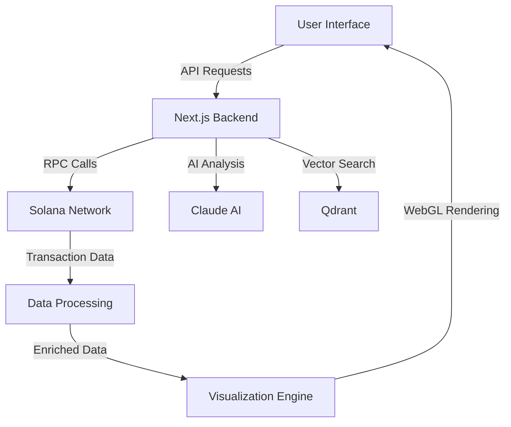

# Introduction to OpenSVM

OpenSVM is a comprehensive Solana blockchain explorer powered by artificial intelligence, providing unprecedented insights into the Solana ecosystem.

## What is OpenSVM?

OpenSVM combines cutting-edge blockchain exploration with AI-powered analytics to give you the most complete view of Solana transactions, accounts, and programs. Built for developers, traders, and blockchain enthusiasts, OpenSVM offers:

- **Real-time Transaction Tracking**: Monitor Solana transactions as they happen with sub-second latency
- **AI-Powered Analysis**: Get natural language explanations of complex transactions using Claude AI
- **Advanced Visualization**: Interactive 3D transaction graphs rendered with WebGL for smooth 60 FPS performance
- **Comprehensive Token Analytics**: Track token holders, supply distribution, and real-time price data
- **DeFi Integration**: Deep integration with major Solana DeFi protocols including Jupiter, Raydium, and more

## Why OpenSVM?

### Speed & Performance
- Processes 65,000+ TPS from the Solana network
- WebGL-accelerated visualizations handle 10,000+ nodes
- Optimized caching for instant page loads

### Intelligence
- Claude AI integration for transaction explanations
- Pattern recognition for suspicious activities
- Smart contract analysis and vulnerability detection

### Comprehensiveness
- Support for 500+ Solana programs
- Integration with 20+ DeFi protocols
- Complete NFT collection analytics

## Architecture Overview

## Key Features

### Transaction Explorer
View detailed information about any Solana transaction including:
- Transaction signature and confirmation status
- Involved accounts and their roles
- Program instructions with decoded parameters
- Token transfers and balance changes
- Fee breakdown and compute unit consumption

### Account Dashboard
Comprehensive account information:
- SOL and SPL token balances
- Transaction history with pagination
- NFT holdings with metadata
- Program ownership and authorities
- Staking information for validators

### Token Analytics
In-depth token metrics:
- Real-time price and market cap
- Holder distribution analysis
- Trading volume and liquidity
- Historical price charts
- Token program details

### AI-Powered Insights
Natural language transaction explanations:
- Automatic summarization of complex transactions
- Security alerts for suspicious patterns
- Gas optimization suggestions
- Smart contract interaction analysis

## Getting Started

1. **Explore the Dashboard**: Start at the homepage to see network statistics and recent activity
2. **Search for Transactions**: Use the search bar to look up any transaction, account, or token
3. **Analyze with AI**: Click "Explain with AI" on any transaction for detailed analysis
4. **Visualize Connections**: View transaction graphs to understand fund flows

## Use Cases

### For Developers
- Debug smart contract interactions
- Analyze program execution and logs
- Monitor deployment transactions
- Integrate via REST API

### For Traders
- Track whale movements
- Monitor token launches
- Analyze DEX trading patterns
- Set up custom alerts

### For Researchers
- Study network behavior
- Analyze DeFi protocols
- Research NFT trends
- Export data for analysis

## Community & Support

- GitHub: [github.com/aldrin-labs/opensvm](https://github.com/aldrin-labs/opensvm)
- Documentation: [opensvm.com/docs](/docs)
- API Reference: [opensvm.com/swagger](/swagger)

## Next Steps

- [Features Overview](/docs/features) - Complete list of OpenSVM capabilities
- [API Documentation](/docs/api-reference) - REST API endpoints and examples
- [Development Guide](/docs/development) - Set up local development environment
